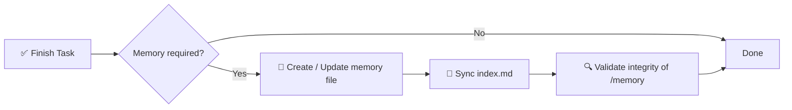

# 🧠 مواصفة نظام ذاكرة الذكاء الاصطناعي

> إطار عمل منظم وملزم للذاكرة لمشاريع البرمجيات المدعومة بالذكاء الاصطناعي.

[](./memory.md)
[](./memory.md)
[](#-قاعدة-التنفيذ)
[](#-الهدف)

<p align="center">
  
</p>

**توقف عن فقدان السياق بين جلسات الذكاء الاصطناعي.** يحدد هذا المستودع طبقة ذاكرة طويلة الأمد حتمية وقابلة للتدقيق، مبنية على مجلد `/memory/` مع ملفات Markdown مفهرسة وتحمل طوابع زمنية — بالإضافة إلى **ذاكرة عالمية** مشتركة (`~/.agents/memory/`) ترافقك في كل مشروع ومستودع وجلسة.

📖 المواصفة المعيارية الكاملة → [`memory.md`](./memory.md)
⚡ مهارة قابلة لإعادة الاستخدام للوكلاء (`ai-memory-system`) → [`.agents/skills/ai-memory-system/SKILL.md`](./.agents/skills/ai-memory-system/SKILL.md) — تعمل مع **Codex وClaude Code وOpenCode وGemini CLI وCursor**.

<!-- README-I18N:START -->
[English](./README.md) | [Español](./README.es.md) | [Português](./README.pt.md) | [Français](./README.fr.md) | [Deutsch](./README.de.md) | [简体中文](./README.zh.md) | [日本語](./README.ja.md) | [한국어](./README.ko.md) | [Русский](./README.ru.md) | **العربية**
<!-- README-I18N:END -->

---

## 📑 جدول المحتويات

- [✨ لماذا هذا موجود](#-لماذا-هذا-موجود)
- [💡 المفهوم الأساسي](#-المفهوم-الأساسي)
- [🌍 ذاكرة المشروع مقابل العالمية](#-ذاكرة-المشروع-مقابل-العالمية)
- [📏 قواعد الذاكرة](#-قواعد-الذاكرة)
- [🧾 تنسيق ملف الذاكرة](#-تنسيق-ملف-الذاكرة)
- [📌 متى تُنشئ ذاكرة](#-متى-تنشئ-ذاكرة)
- [🛡️ قاعدة التنفيذ](#️-قاعدة-التنفيذ)
- [🚀 البدء السريع](#-البدء-السريع)
- [🤖 التثبيت كمهارة](#-التثبيت-كمهارة)
- [💾 مثال](#-مثال)
- [🎯 الهدف](#-الهدف)

---

## ✨ لماذا هذا موجود

وكلاء الذكاء الاصطناعي الحديثون يفقدون السياق بين الجلسات. يحل هذا النظام المشكلة عبر **طبقة ذاكرة حتمية وقابلة للتدقيق**:

| القدرة | الوصف |
|------------|-------------|
| 🏛️ **القرارات** | يتتبع القرارات المعمارية مع مبرراتها |
| 🔧 **إعادة الهيكلة** | يسجل إعادة الهيكلة وتغييرات النظام |
| 📜 **السجل** | يحافظ على سجل مشروع منظم يحمل طوابع زمنية |
| 🔁 **قابلية إعادة الإنتاج** | يتيح قابلية إعادة الإنتاج والتتبع |
| 🌍 **ذاكرة مشتركة** | مخزن عالمي (`~/.agents/memory/`) يعيد استخدام الدروس في **جميع** المشاريع والمستودعات |

> لا مزيد من *«لماذا فعلنا ذلك بهذه الطريقة؟»* — كل تغيير مهم موثق ومفهرس وقابل للبحث.

---

## 💡 المفهوم الأساسي

يفرض المستودع مجلد `/memory/` يعمل **كذاكرة طويلة الأمد للمشروع**.

```
📦 your-repo/
 ┣ 📂 memory/
 ┃ ┣ 📄 index.md                    ← global index (source of truth)
 ┃ ┣ 📄 2026-10-04_22-31_auth-refactor.md
 ┃ ┗ 📄 2026-10-05_09-15_db-schema-v2.md
 ┣ 📄 memory.md                     ← this spec (mandatory rules)
 ┗ 📄 README.md
```

يتكون من:

- **`index.md`** → فهرس الذاكرة العالمي، **المصدر الوحيد للحقيقة**
- **ملفات `*.md`** → إدخالات ذاكرة فردية وذرية

---

## 🌍 ذاكرة المشروع مقابل العالمية

طبقتان. يقرأ الوكيل **كلتيهما** دائمًا:

| الطبقة | الموقع | المحتوى |
|-------|----------|----------|
| 📁 المشروع | `./memory/` في كل مستودع | خاص بالمستودع: بنية هذا المستودع وإعادة هيكلته وأخطاؤه |
| 🌍 العالمية | `~/.agents/memory/` | مشتركة بين **جميع** المستودعات/الجلسات: قرارات وأنماط وتفضيلات قابلة لإعادة الاستخدام |

**قاعدة التوجيه:** الخاص بالمستودع → المشروع (افتراضي). القابل لإعادة الاستخدام في مكان آخر → العالمية (`new-memory.sh --global`). عند الشك → المشروع.

ابحث في كلتيهما معًا:

```bash
bash $SKILL_DIR/scripts/search-memory.sh <keyword> --root .
```

---

## 📏 قواعد الذاكرة

### 1. 🗂️ الهيكل

يجب أن تتبع جميع ملفات الذاكرة تنسيقًا صارمًا:

- ✅ حد أقصى **200 سطر** لكل ملف — عند التجاوز، قسّم إلى ملفات متعددة
- ✅ تنسيق اسم الملف مع الطابع الزمني:

  ```
  YYYY-MM-DD_HH-MM_<slug>.md
  ```

  > مثال: `2026-10-04_22-31_auth-refactor.md`

### 2. 🧭 نظام الفهرس

ملف `index.md`:

- 📋 يسرد **جميع** إدخالات الذاكرة (بدون تكرار، بدون روابط ميتة)
- 🔄 يجب أن يكون **متزامنًا دائمًا** — يُحدَّث بعد كل تغيير
- ⬇️ مرتب **تنازليًا** (الأحدث أولًا)

**التنسيق:**

```md
# MEMORY INDEX

## 2026-10-04

- 22:31 — Auth refactor → ./memory/2026-10-04_22-31_auth-refactor.md
```

---

## 🧾 تنسيق ملف الذاكرة

> يجب أن يتبع كل ملف ذاكرة هذا القالب بدقة:

```md
# Title

## Meta
- Date: YYYY-MM-DD
- Time: HH:MM
- Type: feature | fix | refactor | decision | bug | infra
- Scope: file / module / system affected

## Context
Problem or situation description.

## Action
What was done.

## Result
Final outcome.

## Impact
Effect on system or future decisions.

## Follow-up (optional)
Risks or pending tasks.
```

**قواعد الكتابة:**

- 🚫 ممنوع: النص الفارغ، والعناصر المؤقتة، و`TBD` و`later` و`pending` بدون سياق
- ✅ يجب أن يكون كل شيء **ملموسًا وقابلًا للتحقق ومفيدًا** للتصحيح / التدقيق مستقبلًا

> قوالب جاهزة (ذاكرة، قرار، خطأ، إعادة هيكلة، فهرس) في مجلد `references/` الخاص بالمهارة.

---

## 📌 متى تُنشئ ذاكرة

إدخال الذاكرة **مطلوب** عندما:

| ✅ أنشئ لـ | 🚫 لا تُنشئ لـ |
|------------------|----------------------|
| 🏛️ تغييرات البنية | ✏️ الأخطاء المطبعية |
| 🔧 إعادة الهيكلة | 🎨 التنسيق / الأنماط |
| 🐛 إصلاحات مهمة للأخطاء | 📝 سجلات غير مهمة |
| 🔒 تعديلات الأمان | |
| 🗄️ تحديثات مخطط قاعدة البيانات | |
| ⚙️ تغييرات سير العمل أو الأتمتة | |
| 💡 قرارات تقنية مهمة | |

---

## 🛡️ قاعدة التنفيذ

> ⚠️ **بعد كل مهمة، يجب على النظام:**



1. **تحديد** ما إذا كانت الذاكرة مطلوبة
2. **إنشاء / تحديث** ملف الذاكرة
3. **مزامنة** `index.md`
4. **التحقق** من سلامة `/memory`

❌ **عدم القيام بذلك يُبطل إتمام المهمة.**

---

## 🚀 البدء السريع

```bash
# 1. Create memory directory
mkdir -p memory

# 2. Create the index (source of truth)
cat > memory/index.md << 'EOF'
# MEMORY INDEX

## 2026-10-05

- 09:15 — Initial setup → ./memory/2026-10-05_09-15_initial-setup.md
EOF

# 3. Create your first memory entry
# File: memory/2026-10-05_09-15_initial-setup.md
# (use the template from 🧾 Memory File Format)
```

**قائمة تحقق لكل مهمة ذكاء اصطناعي:**

- [ ] هل تغيرت البنية أو قاعدة البيانات أو الأمان أو سير العمل؟ → أنشئ ذاكرة
- [ ] هل يتبع الاسم `YYYY-MM-DD_HH-MM_<slug>.md`؟
- [ ] هل الملف ≤ 200 سطر؟
- [ ] هل `index.md` محدَّث ومرتب تنازليًا؟
- [ ] هل هو قابل لإعادة الاستخدام في مستودعات أخرى؟ → احفظ عالميًا بـ `new-memory.sh --global` (يذهب إلى `~/.agents/memory/`)

---

## 🤖 التثبيت كمهارة

هذا المستودع **مهارة متعددة الوكلاء** جاهزة للاستخدام (`ai-memory-system`) لـ **Codex وClaude Code وOpenCode وGemini CLI وCursor** (معيار Agent Skills: `SKILL.md`).

**الهيكل** (`.agents/` هو المرجع — لا تحرر نسخة مباشرة أبدًا):

```
.agents/skills/ai-memory-system/     ← canonical (Codex, Gemini alias, OpenCode)
.claude/skills/ai-memory-system/     ← mirror (Claude Code)
.gemini/skills/ai-memory-system/     ← mirror (Gemini CLI)
.opencode/skills/ai-memory-system/   ← mirror (OpenCode)
├── SKILL.md                         ← skill definition (Recall → Act → Persist)
├── references/                      ← memory, decision, bug, refactor, index templates
└── scripts/                         ← new-memory, validate-memory, search-memory, install-global, sync-vendors
```

**التثبيت العالمي (موصى به — المهارة + `/memory` في *كل* مشروع):**

```bash
bash .agents/skills/ai-memory-system/scripts/install-global.sh --force
# Restart your agent, then type /memory anywhere
```

يثبت المهارة في `~/.agents/skills/` و`~/.claude/skills/` و`~/.gemini/skills/` و`~/.config/opencode/skills/` و`~/.cursor/skills/`، وأمر `/memory` لـ OpenCode / Claude / Gemini، وينشئ المخزن المشترك `~/.agents/memory/`.

**لكل مشروع (هذا المستودع فقط):** انسخ `.agents/skills/ai-memory-system` إلى مجلد مهارات وكيلك — انظر `AGENTS.md` §3 لجميع المسارات.

**أمر slash:**

- `/memory` → تذكُّر (المشروع + العالمية)
- `/memory save <الوصف>` → حفظ (يوجه للمشروع مقابل العالمية)

**تحقق بعد التثبيت:**

```bash
bash $SKILL_DIR/scripts/validate-memory.sh --root .                  # project memory
bash $SKILL_DIR/scripts/validate-memory.sh --memdir ~/.agents/memory # global memory
# ✅ memory system is valid
```

> تغلف المهارة المواصفة الكاملة [`memory.md`](./memory.md) في سير عمل تذكَّر → نفِّذ → احفظ مع القوالب والتحقق. تعليمات الوكلاء: [`AGENTS.md`](./AGENTS.md).

---

## 💾 مثال

**الملف:** `memory/2026-10-04_22-31_auth-refactor.md`

```md
# Auth Refactor to JWT

## Meta
- Date: 2026-10-04
- Time: 22:31
- Type: refactor
- Scope: auth/ module

## Context
Session-based auth caused scaling issues with multiple instances.

## Action
Migrated to stateless JWT with refresh-token rotation.

## Result
Auth is now stateless; login latency -30%.

## Impact
Requires `JWT_SECRET` in env. All future services must validate JWT.

## Follow-up
Rotate secrets every 90 days. Add logout blocklist.
```

وفي `index.md`:

```md
## 2026-10-04

- 22:31 — Auth refactor to JWT → ./memory/2026-10-04_22-31_auth-refactor.md
```

---

## 🎯 الهدف

> تزويد أنظمة الذكاء الاصطناعي **بطبقة ذاكرة دائمة ومنظمة وقابلة للتدقيق** تحسن استمرارية الاستدلال عبر جلسات التطوير.

**المبادئ:** 📐 حتمية · 🔍 قابلة للتدقيق · 🤖 قابلة للتنفيذ بواسطة الوكلاء · 🕰️ سفر عبر الزمن

---

<p align="center">
  <sub>مصمم لوكلاء الذكاء الاصطناعي الذين يحتاجون إلى <b>التذكر</b>. 🧠✨</sub><br>
  <a href="./memory.md">📖 اقرأ المواصفة الكاملة</a>
</p>

---

<!-- SEO: keywords for GitHub search and Google indexing -->
<!-- ai-agents, ai-memory, llm-memory, llm, context-management, agent-skills, opencode, claude-skills, prompt-engineering, software-architecture, knowledge-management, developer-tools, documentation, traceability, reproducibility -->

<details>
<summary>🏷️ Keywords</summary>

`ai-agents` · `ai-memory` · `llm` · `llm-memory` · `context-management` · `agent-skills` · `opencode` · `claude-skills` · `prompt-engineering` · `software-architecture` · `knowledge-management` · `developer-tools` · `documentation` · `traceability` · `reproducibility`

</details>
