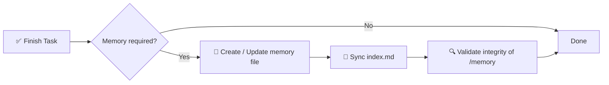

# 🧠 KI-Memory-System-Spezifikation

> Ein strukturiertes, verbindliches Memory-Framework für KI-gestützte Softwareprojekte.

[](./memory.md)
[](./memory.md)
[](#-durchsetzungsregel)
[](#-ziel)

**Verliere keinen Kontext mehr zwischen KI-Sitzungen.** Dieses Repo definiert eine deterministische, prüfbare Langzeit-Memory-Schicht auf Basis eines `/memory/`-Verzeichnisses mit indexierten, zeitgestempelten Markdown-Dateien.

📖 Vollständige normative Spezifikation → [`memory.md`](./memory.md)
⚡ Wiederverwendbarer Agent-Skill → [`.opencode/skills/ai-memory-system/SKILL.md`](./.opencode/skills/ai-memory-system/SKILL.md)

<!-- README-I18N:START -->
[English](./README.md) | [Español](./README.es.md) | [Português](./README.pt.md) | [Français](./README.fr.md) | **Deutsch** | [简体中文](./README.zh.md) | [日本語](./README.ja.md) | [한국어](./README.ko.md) | [Русский](./README.ru.md) | [العربية](./README.ar.md)
<!-- README-I18N:END -->

---

## 📑 Inhaltsverzeichnis

- [✨ Warum es das gibt](#-warum-es-das-gibt)
- [💡 Kernkonzept](#-kernkonzept)
- [📏 Memory-Regeln](#-memory-regeln)
- [🧾 Memory-Dateiformat](#-memory-dateiformat)
- [📌 Wann Memory anzulegen ist](#-wann-memory-anzulegen-ist)
- [🛡️ Durchsetzungsregel](#️-durchsetzungsregel)
- [🚀 Schnellstart](#-schnellstart)
- [🤖 Als Skill installieren](#-als-skill-installieren)
- [💾 Beispiel](#-beispiel)
- [🎯 Ziel](#-ziel)

---

## ✨ Warum es das gibt

Moderne KI-Agenten verlieren Kontext zwischen Sitzungen. Dieses System löst das mit einer **deterministischen, prüfbaren Memory-Schicht**, die:

| Fähigkeit | Beschreibung |
|------------|-------------|
| 🏛️ **Entscheidungen** | Verfolgt Architekturentscheidungen mit Begründung |
| 🔧 **Refactors** | Erfasst Refactors und Systemänderungen |
| 📜 **Historie** | Pflegt eine strukturierte, zeitgestempelte Projekthistorie |
| 🔁 **Reproduzierbarkeit** | Ermöglicht Reproduzierbarkeit und Rückverfolgbarkeit |

> Kein *„Warum haben wir das so gemacht?"* mehr — jede wichtige Änderung ist dokumentiert, indexiert und durchsuchbar.

---

## 💡 Kernkonzept

Das Repository erzwingt einen `/memory/`-Ordner, der als **Langzeitgedächtnis des Projekts** dient.

```
📦 your-repo/
 ┣ 📂 memory/
 ┃ ┣ 📄 index.md                    ← global index (source of truth)
 ┃ ┣ 📄 2026-10-04_22-31_auth-refactor.md
 ┃ ┗ 📄 2026-10-05_09-15_db-schema-v2.md
 ┣ 📄 memory.md                     ← this spec (mandatory rules)
 ┗ 📄 README.md
```

Er besteht aus:

- **`index.md`** → globaler Memory-Index, die **einzige Quelle der Wahrheit**
- **`*.md`-Dateien** → einzelne, atomare Memory-Einträge

---

## 📏 Memory-Regeln

### 1. 🗂️ Struktur

Alle Memory-Dateien müssen strikter Formatierung folgen:

- ✅ Max. **200 Zeilen** pro Datei — bei Überschreitung in mehrere Dateien aufteilen (sharden)
- ✅ Dateinameformat mit Zeitstempel:

  ```
  YYYY-MM-DD_HH-MM_<slug>.md
  ```

  > Beispiel: `2026-10-04_22-31_auth-refactor.md`

### 2. 🧭 Indexsystem

Die Datei `index.md`:

- 📋 Listet **alle** Memory-Einträge (keine Duplikate, keine toten Links)
- 🔄 Muss **immer synchronisiert sein** — nach jeder Änderung aktualisiert
- ⬇️ **Absteigend** sortiert (neueste zuerst)

**Format:**

```md
# MEMORY INDEX

## 2026-10-04

- 22:31 — Auth refactor → ./memory/2026-10-04_22-31_auth-refactor.md
```

---

## 🧾 Memory-Dateiformat

> Jede Memory-Datei muss exakt dieser Vorlage folgen:

```md
# Title

## Meta
- Date: YYYY-MM-DD
- Time: HH:MM
- Type: feature | fix | refactor | decision | bug | infra
- Scope: file / module / system affected

## Context
Problem or situation description.

## Action
What was done.

## Result
Final outcome.

## Impact
Effect on system or future decisions.

## Follow-up (optional)
Risks or pending tasks.
```

**Schreibregeln:**

- 🚫 Verboten: leerer Text, Platzhalter, `TBD`, `later`, `pending` ohne Kontext
- ✅ Alles muss **konkret, überprüfbar und nützlich** für zukünftiges Debugging / Audit sein

---

## 📌 Wann Memory anzulegen ist

Ein Memory-Eintrag ist **erforderlich** bei:

| ✅ ANLEGEN für | 🚫 NICHT anlegen für |
|------------------|----------------------|
| 🏛️ Architekturänderungen | ✏️ Tippfehler |
| 🔧 Refactors | 🎨 Formatierung / Styling |
| 🐛 Wichtige Bugfixes | 📝 Irrelevante Logs |
| 🔒 Sicherheitsänderungen | |
| 🗄️ DB-Schema-Updates | |
| ⚙️ Workflow- oder Automatisierungsänderungen | |
| 💡 Wichtige technische Entscheidungen | |

---

## 🛡️ Durchsetzungsregel

> ⚠️ **Nach jeder Aufgabe muss das System:**



1. **Bestimmen**, ob Memory erforderlich ist
2. Memory-Datei **erstellen / aktualisieren**
3. `index.md` **synchronisieren**
4. Integrität von `/memory` **validieren**

❌ **Andernfalls gilt die Aufgabe als nicht abgeschlossen.**

---

## 🚀 Schnellstart

```bash
# 1. Create memory directory
mkdir -p memory

# 2. Create the index (source of truth)
cat > memory/index.md << 'EOF'
# MEMORY INDEX

## 2026-10-05

- 09:15 — Initial setup → ./memory/2026-10-05_09-15_initial-setup.md
EOF

# 3. Create your first memory entry
# File: memory/2026-10-05_09-15_initial-setup.md
# (use the template from 🧾 Memory File Format)
```

**Checkliste für jede KI-Aufgabe:**

- [ ] Architektur, DB, Sicherheit oder Workflow geändert? → Memory anlegen
- [ ] Dateiname folgt `YYYY-MM-DD_HH-MM_<slug>.md`?
- [ ] Datei ≤ 200 Zeilen?
- [ ] `index.md` aktualisiert und absteigend sortiert?

---

## 🤖 Als Skill installieren

Dieses Repo ist auch ein einsatzbereiter **OpenCode- / Claude- / Agents-Skill** (`ai-memory-system`).

```
.opencode/skills/ai-memory-system/
├── SKILL.md                      ← skill definition (frontmatter + workflow)
├── references/
│   ├── memory-template.md        ← copy-paste memory file template
│   └── index-template.md         ← copy-paste index.md example
└── scripts/
    └── validate-memory.sh        ← integrity checker
```

**In deinem Projekt verwenden:**

```bash
# Option A — copy into your project (OpenCode)
mkdir -p .opencode/skills
cp -r /path/to/this-repo/.opencode/skills/ai-memory-system .opencode/skills/

# Option B — global install (all projects)
mkdir -p ~/.config/opencode/skills
cp -r /path/to/this-repo/.opencode/skills/ai-memory-system ~/.config/opencode/skills/

# Claude-compatible paths also work:
# .claude/skills/ , ~/.claude/skills/ , .agents/skills/ , ~/.agents/skills/
```

**Nach der Installation validieren:**

```bash
bash .opencode/skills/ai-memory-system/scripts/validate-memory.sh --root .
# ✅ memory/ and index.md exist
# ✅ memory system is valid
```

Nach der Installation entdeckt der Agent ihn automatisch über das `skill`-Tool:

```
skill({ name: "ai-memory-system" })
```

> Der Skill verpackt die vollständige [`memory.md`](./memory.md)-Spezifikation in einen Erinnern → Handeln → Persistieren-Workflow mit Vorlagen und Validierung.

---

## 💾 Beispiel

**Datei:** `memory/2026-10-04_22-31_auth-refactor.md`

```md
# Auth Refactor to JWT

## Meta
- Date: 2026-10-04
- Time: 22:31
- Type: refactor
- Scope: auth/ module

## Context
Session-based auth caused scaling issues with multiple instances.

## Action
Migrated to stateless JWT with refresh-token rotation.

## Result
Auth is now stateless; login latency -30%.

## Impact
Requires `JWT_SECRET` in env. All future services must validate JWT.

## Follow-up
Rotate secrets every 90 days. Add logout blocklist.
```

Und in `index.md`:

```md
## 2026-10-04

- 22:31 — Auth refactor to JWT → ./memory/2026-10-04_22-31_auth-refactor.md
```

---

## 🎯 Ziel

> KI-Systemen eine **persistente, strukturierte und prüfbare Memory-Schicht** zu geben, die die Kontinuität des Denkens über Entwicklungssitzungen hinweg verbessert.

**Prinzipien:** 📐 Deterministisch · 🔍 Prüfbar · 🤖 Agent-durchsetzbar · 🕰️ Zeitreisefähig

---

<p align="center">
  <sub>Gebaut für KI-Agenten, die sich <b>erinnern</b> müssen. 🧠✨</sub><br>
  <a href="./memory.md">📖 Vollständige Spezifikation lesen</a>
</p>

---

<!-- SEO: keywords for GitHub search and Google indexing -->
<!-- ai-agents, ai-memory, llm-memory, llm, context-management, agent-skills, opencode, claude-skills, prompt-engineering, software-architecture, knowledge-management, developer-tools, documentation, traceability, reproducibility -->

<details>
<summary>🏷️ Keywords</summary>

`ai-agents` · `ai-memory` · `llm` · `llm-memory` · `context-management` · `agent-skills` · `opencode` · `claude-skills` · `prompt-engineering` · `software-architecture` · `knowledge-management` · `developer-tools` · `documentation` · `traceability` · `reproducibility`

</details>
