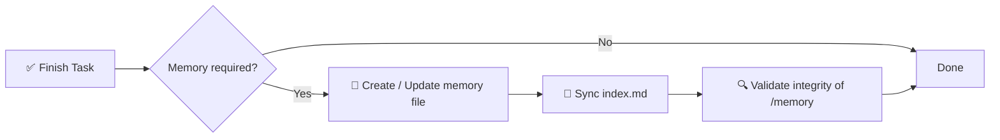

# 🧠 Especificación del Sistema de Memoria IA

> Un framework de memoria estructurado y obligatorio para proyectos de software asistidos por IA.

[](./memory.md)
[](./memory.md)
[](#-regla-de-cumplimiento)
[](#-objetivo)

**Deja de perder contexto entre sesiones de IA.** Este repo define una capa de memoria determinista, auditable y a largo plazo basada en un directorio `/memory/` con archivos Markdown indexados y con marca de tiempo.

📖 Especificación normativa completa → [`memory.md`](./memory.md)
⚡ Skill reutilizable para agentes → [`.opencode/skills/ai-memory-system/SKILL.md`](./.opencode/skills/ai-memory-system/SKILL.md)

<!-- README-I18N:START -->
[English](./README.md) | **Español** | [Português](./README.pt.md) | [Français](./README.fr.md) | [Deutsch](./README.de.md) | [简体中文](./README.zh.md) | [日本語](./README.ja.md) | [한국어](./README.ko.md) | [Русский](./README.ru.md) | [العربية](./README.ar.md)
<!-- README-I18N:END -->

---

## 📑 Tabla de contenidos

- [✨ Por qué existe](#-por-qué-existe)
- [💡 Concepto central](#-concepto-central)
- [📏 Reglas de memoria](#-reglas-de-memoria)
- [🧾 Formato de archivo de memoria](#-formato-de-archivo-de-memoria)
- [📌 Cuándo crear memoria](#-cuándo-crear-memoria)
- [🛡️ Regla de cumplimiento](#️-regla-de-cumplimiento)
- [🚀 Inicio rápido](#-inicio-rápido)
- [🤖 Instalar como skill](#-instalar-como-skill)
- [💾 Ejemplo](#-ejemplo)
- [🎯 Objetivo](#-objetivo)

---

## ✨ Por qué existe

Los agentes de IA modernos pierden contexto entre sesiones. Este sistema lo resuelve con una **capa de memoria determinista y auditable** que:

| Capacidad | Descripción |
|------------|-------------|
| 🏛️ **Decisiones** | Registra decisiones arquitectónicas con su justificación |
| 🔧 **Refactors** | Registra refactors y cambios del sistema |
| 📜 **Historial** | Mantiene un historial de proyecto estructurado y con marca de tiempo |
| 🔁 **Reproducibilidad** | Permite reproducibilidad y trazabilidad |

> Basta de *"¿por qué lo hicimos así?"* — cada cambio importante está documentado, indexado y se puede buscar.

---

## 💡 Concepto central

El repositorio exige una carpeta `/memory/` que actúa como la **memoria a largo plazo del proyecto**.

```
📦 your-repo/
 ┣ 📂 memory/
 ┃ ┣ 📄 index.md                    ← global index (source of truth)
 ┃ ┣ 📄 2026-10-04_22-31_auth-refactor.md
 ┃ ┗ 📄 2026-10-05_09-15_db-schema-v2.md
 ┣ 📄 memory.md                     ← this spec (mandatory rules)
 ┗ 📄 README.md
```

Se compone de:

- **`index.md`** → índice global de memoria, la **única fuente de verdad**
- **archivos `*.md`** → entradas de memoria individuales y atómicas

---

## 📏 Reglas de memoria

### 1. 🗂️ Estructura

Todos los archivos de memoria deben seguir un formato estricto:

- ✅ Máx. **200 líneas** por archivo — si se supera, dividir (fragmentar) en varios archivos
- ✅ Formato de nombre con marca de tiempo:

  ```
  YYYY-MM-DD_HH-MM_<slug>.md
  ```

  > Ejemplo: `2026-10-04_22-31_auth-refactor.md`

### 2. 🧭 Sistema de índice

El archivo `index.md`:

- 📋 Lista **todas** las entradas de memoria (sin duplicados, sin enlaces rotos)
- 🔄 Debe estar **siempre sincronizado** — se actualiza después de cada cambio
- ⬇️ Ordenado de forma **descendente** (lo más reciente primero)

**Formato:**

```md
# MEMORY INDEX

## 2026-10-04

- 22:31 — Auth refactor → ./memory/2026-10-04_22-31_auth-refactor.md
```

---

## 🧾 Formato de archivo de memoria

> Cada archivo de memoria debe seguir exactamente esta plantilla:

```md
# Title

## Meta
- Date: YYYY-MM-DD
- Time: HH:MM
- Type: feature | fix | refactor | decision | bug | infra
- Scope: file / module / system affected

## Context
Problem or situation description.

## Action
What was done.

## Result
Final outcome.

## Impact
Effect on system or future decisions.

## Follow-up (optional)
Risks or pending tasks.
```

**Reglas de escritura:**

- 🚫 Prohibido: texto vacío, marcadores de posición, `TBD`, `later`, `pending` sin contexto
- ✅ Todo debe ser **concreto, verificable y útil** para futuras depuraciones / auditorías

---

## 📌 Cuándo crear memoria

Una entrada de memoria es **obligatoria** cuando:

| ✅ SÍ crear para | 🚫 NO crear para |
|------------------|----------------------|
| 🏛️ Cambios de arquitectura | ✏️ Erratas |
| 🔧 Refactors | 🎨 Formato / estilo |
| 🐛 Correcciones importantes de bugs | 📝 Registros irrelevantes |
| 🔒 Modificaciones de seguridad | |
| 🗄️ Actualizaciones del esquema de BD | |
| ⚙️ Cambios de flujo o automatización | |
| 💡 Decisiones técnicas importantes | |

---

## 🛡️ Regla de cumplimiento

> ⚠️ **Después de cada tarea, el sistema debe:**



1. **Determinar** si se requiere memoria
2. **Crear / actualizar** el archivo de memoria
3. **Sincronizar** `index.md`
4. **Validar** la integridad de `/memory`

❌ **No hacerlo invalida la finalización de la tarea.**

---

## 🚀 Inicio rápido

```bash
# 1. Create memory directory
mkdir -p memory

# 2. Create the index (source of truth)
cat > memory/index.md << 'EOF'
# MEMORY INDEX

## 2026-10-05

- 09:15 — Initial setup → ./memory/2026-10-05_09-15_initial-setup.md
EOF

# 3. Create your first memory entry
# File: memory/2026-10-05_09-15_initial-setup.md
# (use the template from 🧾 Memory File Format)
```

**Lista de verificación para cada tarea de IA:**

- [ ] ¿Cambió la arquitectura, BD, seguridad o flujo? → crear memoria
- [ ] ¿El nombre sigue `YYYY-MM-DD_HH-MM_<slug>.md`?
- [ ] ¿El archivo tiene ≤ 200 líneas?
- [ ] ¿`index.md` actualizado y ordenado descendente?

---

## 🤖 Instalar como skill

Este repo también es un **skill listo para usar en OpenCode / Claude / Agents** (`ai-memory-system`).

```
.opencode/skills/ai-memory-system/
├── SKILL.md                      ← skill definition (frontmatter + workflow)
├── references/
│   ├── memory-template.md        ← copy-paste memory file template
│   └── index-template.md         ← copy-paste index.md example
└── scripts/
    └── validate-memory.sh        ← integrity checker
```

**Úsalo en tu proyecto:**

```bash
# Option A — copy into your project (OpenCode)
mkdir -p .opencode/skills
cp -r /path/to/this-repo/.opencode/skills/ai-memory-system .opencode/skills/

# Option B — global install (all projects)
mkdir -p ~/.config/opencode/skills
cp -r /path/to/this-repo/.opencode/skills/ai-memory-system ~/.config/opencode/skills/

# Claude-compatible paths also work:
# .claude/skills/ , ~/.claude/skills/ , .agents/skills/ , ~/.agents/skills/
```

**Valida después de instalar:**

```bash
bash .opencode/skills/ai-memory-system/scripts/validate-memory.sh --root .
# ✅ memory/ and index.md exist
# ✅ memory system is valid
```

Una vez instalado, el agente lo descubre automáticamente vía la herramienta `skill`:

```
skill({ name: "ai-memory-system" })
```

> El skill envuelve la especificación completa [`memory.md`](./memory.md) en un flujo Recordar → Actuar → Persistir con plantillas y validación.

---

## 💾 Ejemplo

**Archivo:** `memory/2026-10-04_22-31_auth-refactor.md`

```md
# Auth Refactor to JWT

## Meta
- Date: 2026-10-04
- Time: 22:31
- Type: refactor
- Scope: auth/ module

## Context
Session-based auth caused scaling issues with multiple instances.

## Action
Migrated to stateless JWT with refresh-token rotation.

## Result
Auth is now stateless; login latency -30%.

## Impact
Requires `JWT_SECRET` in env. All future services must validate JWT.

## Follow-up
Rotate secrets every 90 days. Add logout blocklist.
```

Y en `index.md`:

```md
## 2026-10-04

- 22:31 — Auth refactor to JWT → ./memory/2026-10-04_22-31_auth-refactor.md
```

---

## 🎯 Objetivo

> Proveer a los sistemas de IA una **capa de memoria persistente, estructurada y auditable** que mejore la continuidad del razonamiento entre sesiones de desarrollo.

**Principios:** 📐 Determinista · 🔍 Auditable · 🤖 Exigible por agentes · 🕰️ Viaje en el tiempo

---

<p align="center">
  <sub>Hecho para agentes de IA que necesitan <b>recordar</b>. 🧠✨</sub><br>
  <a href="./memory.md">📖 Leer la especificación completa</a>
</p>

---

<!-- SEO: keywords for GitHub search and Google indexing -->
<!-- ai-agents, ai-memory, llm-memory, llm, context-management, agent-skills, opencode, claude-skills, prompt-engineering, software-architecture, knowledge-management, developer-tools, documentation, traceability, reproducibility -->

<details>
<summary>🏷️ Keywords</summary>

`ai-agents` · `ai-memory` · `llm` · `llm-memory` · `context-management` · `agent-skills` · `opencode` · `claude-skills` · `prompt-engineering` · `software-architecture` · `knowledge-management` · `developer-tools` · `documentation` · `traceability` · `reproducibility`

</details>
