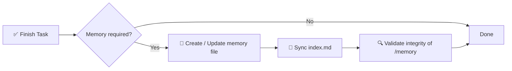

# 🧠 Spécification du système de mémoire IA

> Un framework de mémoire structuré et contraignant pour les projets logiciels assistés par IA.

[](./memory.md)
[](./memory.md)
[](#-règle-dexécution)
[](#-objectif)

**Arrêtez de perdre le contexte entre les sessions d'IA.** Ce repo définit une couche de mémoire déterministe, auditable et à long terme basée sur un dossier `/memory/` avec des fichiers Markdown indexés et horodatés.

📖 Spécification normative complète → [`memory.md`](./memory.md)
⚡ Skill réutilisable pour agents → [`.opencode/skills/ai-memory-system/SKILL.md`](./.opencode/skills/ai-memory-system/SKILL.md)

<!-- README-I18N:START -->
[English](./README.md) | [Español](./README.es.md) | [Português](./README.pt.md) | **Français** | [Deutsch](./README.de.md) | [简体中文](./README.zh.md) | [日本語](./README.ja.md) | [한국어](./README.ko.md) | [Русский](./README.ru.md) | [العربية](./README.ar.md)
<!-- README-I18N:END -->

---

## 📑 Table des matières

- [✨ Pourquoi ça existe](#-pourquoi-ça-existe)
- [💡 Concept central](#-concept-central)
- [📏 Règles de mémoire](#-règles-de-mémoire)
- [🧾 Format de fichier mémoire](#-format-de-fichier-mémoire)
- [📌 Quand créer une mémoire](#-quand-créer-une-mémoire)
- [🛡️ Règle d'exécution](#️-règle-dexécution)
- [🚀 Démarrage rapide](#-démarrage-rapide)
- [🤖 Installer comme skill](#-installer-comme-skill)
- [💾 Exemple](#-exemple)
- [🎯 Objectif](#-objectif)

---

## ✨ Pourquoi ça existe

Les agents IA modernes perdent le contexte entre les sessions. Ce système résout ce problème avec une **couche de mémoire déterministe et auditable** qui :

| Capacité | Description |
|------------|-------------|
| 🏛️ **Décisions** | Suit les décisions architecturales avec leur justification |
| 🔧 **Refactors** | Enregistre les refactors et les changements système |
| 📜 **Historique** | Maintient un historique de projet structuré et horodaté |
| 🔁 **Reproductibilité** | Permet la reproductibilité et la traçabilité |

> Fini le *« pourquoi avons-nous fait comme ça ? »* — chaque changement important est documenté, indexé et interrogeable.

---

## 💡 Concept central

Le dépôt impose un dossier `/memory/` qui agit comme la **mémoire à long terme du projet**.

```
📦 your-repo/
 ┣ 📂 memory/
 ┃ ┣ 📄 index.md                    ← global index (source of truth)
 ┃ ┣ 📄 2026-10-04_22-31_auth-refactor.md
 ┃ ┗ 📄 2026-10-05_09-15_db-schema-v2.md
 ┣ 📄 memory.md                     ← this spec (mandatory rules)
 ┗ 📄 README.md
```

Il se compose de :

- **`index.md`** → index global de mémoire, la **source unique de vérité**
- **fichiers `*.md`** → entrées de mémoire individuelles et atomiques

---

## 📏 Règles de mémoire

### 1. 🗂️ Structure

Tous les fichiers mémoire doivent suivre un formatage strict :

- ✅ Max **200 lignes** par fichier — si dépassé, diviser (fragmenter) en plusieurs fichiers
- ✅ Format de nom horodaté :

  ```
  YYYY-MM-DD_HH-MM_<slug>.md
  ```

  > Exemple : `2026-10-04_22-31_auth-refactor.md`

### 2. 🧭 Système d'index

Le fichier `index.md` :

- 📋 Liste **toutes** les entrées de mémoire (sans doublons, sans liens morts)
- 🔄 Doit **toujours être synchronisé** — mis à jour après chaque changement
- ⬇️ Ordonné par ordre **décroissant** (le plus récent d'abord)

**Format :**

```md
# MEMORY INDEX

## 2026-10-04

- 22:31 — Auth refactor → ./memory/2026-10-04_22-31_auth-refactor.md
```

---

## 🧾 Format de fichier mémoire

> Chaque fichier mémoire doit suivre exactement ce modèle :

```md
# Title

## Meta
- Date: YYYY-MM-DD
- Time: HH:MM
- Type: feature | fix | refactor | decision | bug | infra
- Scope: file / module / system affected

## Context
Problem or situation description.

## Action
What was done.

## Result
Final outcome.

## Impact
Effect on system or future decisions.

## Follow-up (optional)
Risks or pending tasks.
```

**Règles de rédaction :**

- 🚫 Interdit : texte vide, placeholders, `TBD`, `later`, `pending` sans contexte
- ✅ Tout doit être **concret, vérifiable et utile** pour le débogage / l'audit futur

---

## 📌 Quand créer une mémoire

Une entrée de mémoire est **requise** quand :

| ✅ CRÉER pour | 🚫 NE PAS créer pour |
|------------------|----------------------|
| 🏛️ Changements d'architecture | ✏️ Coquilles |
| 🔧 Refactors | 🎨 Formatage / style |
| 🐛 Corrections de bugs importantes | 📝 Logs non pertinents |
| 🔒 Modifications de sécurité | |
| 🗄️ Mises à jour du schéma BD | |
| ⚙️ Changements de workflow ou d'automatisation | |
| 💡 Décisions techniques majeures | |

---

## 🛡️ Règle d'exécution

> ⚠️ **Après chaque tâche, le système doit :**



1. **Déterminer** si une mémoire est requise
2. **Créer / mettre à jour** le fichier mémoire
3. **Synchroniser** `index.md`
4. **Valider** l'intégrité de `/memory`

❌ **Ne pas le faire invalide l'achèvement de la tâche.**

---

## 🚀 Démarrage rapide

```bash
# 1. Create memory directory
mkdir -p memory

# 2. Create the index (source of truth)
cat > memory/index.md << 'EOF'
# MEMORY INDEX

## 2026-10-05

- 09:15 — Initial setup → ./memory/2026-10-05_09-15_initial-setup.md
EOF

# 3. Create your first memory entry
# File: memory/2026-10-05_09-15_initial-setup.md
# (use the template from 🧾 Memory File Format)
```

**Checklist pour chaque tâche IA :**

- [ ] Architecture, BD, sécurité ou workflow modifié ? → créer une mémoire
- [ ] Nom conforme à `YYYY-MM-DD_HH-MM_<slug>.md` ?
- [ ] Fichier ≤ 200 lignes ?
- [ ] `index.md` mis à jour et trié par ordre décroissant ?

---

## 🤖 Installer comme skill

Ce repo est aussi un **skill prêt à l'emploi pour OpenCode / Claude / Agents** (`ai-memory-system`).

```
.opencode/skills/ai-memory-system/
├── SKILL.md                      ← skill definition (frontmatter + workflow)
├── references/
│   ├── memory-template.md        ← copy-paste memory file template
│   └── index-template.md         ← copy-paste index.md example
└── scripts/
    └── validate-memory.sh        ← integrity checker
```

**Utilisation dans votre projet :**

```bash
# Option A — copy into your project (OpenCode)
mkdir -p .opencode/skills
cp -r /path/to/this-repo/.opencode/skills/ai-memory-system .opencode/skills/

# Option B — global install (all projects)
mkdir -p ~/.config/opencode/skills
cp -r /path/to/this-repo/.opencode/skills/ai-memory-system ~/.config/opencode/skills/

# Claude-compatible paths also work:
# .claude/skills/ , ~/.claude/skills/ , .agents/skills/ , ~/.agents/skills/
```

**Valider après l'installation :**

```bash
bash .opencode/skills/ai-memory-system/scripts/validate-memory.sh --root .
# ✅ memory/ and index.md exist
# ✅ memory system is valid
```

Une fois installé, l'agent le découvre automatiquement via l'outil `skill` :

```
skill({ name: "ai-memory-system" })
```

> Le skill enveloppe la spécification complète [`memory.md`](./memory.md) dans un workflow Rappeler → Agir → Persister avec modèles et validation.

---

## 💾 Exemple

**Fichier :** `memory/2026-10-04_22-31_auth-refactor.md`

```md
# Auth Refactor to JWT

## Meta
- Date: 2026-10-04
- Time: 22:31
- Type: refactor
- Scope: auth/ module

## Context
Session-based auth caused scaling issues with multiple instances.

## Action
Migrated to stateless JWT with refresh-token rotation.

## Result
Auth is now stateless; login latency -30%.

## Impact
Requires `JWT_SECRET` in env. All future services must validate JWT.

## Follow-up
Rotate secrets every 90 days. Add logout blocklist.
```

Et dans `index.md` :

```md
## 2026-10-04

- 22:31 — Auth refactor to JWT → ./memory/2026-10-04_22-31_auth-refactor.md
```

---

## 🎯 Objectif

> Fournir aux systèmes IA une **couche de mémoire persistante, structurée et auditable** qui améliore la continuité du raisonnement entre les sessions de développement.

**Principes :** 📐 Déterministe · 🔍 Auditable · 🤖 Applicable par les agents · 🕰️ Voyage dans le temps

---

<p align="center">
  <sub>Conçu pour les agents IA qui ont besoin de <b>se souvenir</b>. 🧠✨</sub><br>
  <a href="./memory.md">📖 Lire la spécification complète</a>
</p>

---

<!-- SEO: keywords for GitHub search and Google indexing -->
<!-- ai-agents, ai-memory, llm-memory, llm, context-management, agent-skills, opencode, claude-skills, prompt-engineering, software-architecture, knowledge-management, developer-tools, documentation, traceability, reproducibility -->

<details>
<summary>🏷️ Keywords</summary>

`ai-agents` · `ai-memory` · `llm` · `llm-memory` · `context-management` · `agent-skills` · `opencode` · `claude-skills` · `prompt-engineering` · `software-architecture` · `knowledge-management` · `developer-tools` · `documentation` · `traceability` · `reproducibility`

</details>
