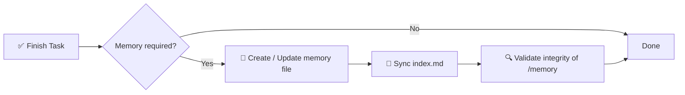

# 🧠 AI メモリシステム仕様

> AI 支援ソフトウェアプロジェクトのための構造化された強制可能なメモリフレームワーク。

[](./memory.md)
[](./memory.md)
[](#-強制ルール)
[](#-ゴール)

<p align="center">
  
</p>

**AI セッション間でコンテキストを失うのはもう終わりに。** このリポジトリは、インデックス付き・タイムスタンプ付き Markdown ファイルによる `/memory/` ディレクトリを基盤とした、決定論的で監査可能な長期メモリ層を定義します——さらに、すべてのプロジェクト・リポジトリ・セッションで使える共有**グローバルメモリ**（`~/.agents/memory/`）付きです。

📖 完全な規範仕様 → [`memory.md`](./memory.md)
⚡ 再利用可能なエージェントスキル（`ai-memory-system`）→ [`.agents/skills/ai-memory-system/SKILL.md`](./.agents/skills/ai-memory-system/SKILL.md)——**Codex、Claude Code、OpenCode、Gemini CLI、Cursor** に対応。

<!-- README-I18N:START -->
[English](./README.md) | [Español](./README.es.md) | [Português](./README.pt.md) | [Français](./README.fr.md) | [Deutsch](./README.de.md) | [简体中文](./README.zh.md) | **日本語** | [한국어](./README.ko.md) | [Русский](./README.ru.md) | [العربية](./README.ar.md)
<!-- README-I18N:END -->

---

## 📑 目次

- [✨ なぜ必要なのか](#-なぜ必要なのか)
- [💡 コアコンセプト](#-コアコンセプト)
- [🌍 プロジェクト vs グローバルメモリ](#-プロジェクト-vs-グローバルメモリ)
- [📏 メモリルール](#-メモリルール)
- [🧾 メモリファイル形式](#-メモリファイル形式)
- [📌 メモリを作成するタイミング](#-メモリを作成するタイミング)
- [🛡️ 強制ルール](#️-強制ルール)
- [🚀 クイックスタート](#-クイックスタート)
- [🤖 スキルとしてインストール](#-スキルとしてインストール)
- [💾 例](#-例)
- [🎯 ゴール](#-ゴール)

---

## ✨ なぜ必要なのか

現代の AI エージェントはセッション間でコンテキストを失います。このシステムは**決定論的で監査可能なメモリ層**でそれを解決します：

| 機能 | 説明 |
|------------|-------------|
| 🏛️ **決定** | アーキテクチャ決定を根拠とともに記録 |
| 🔧 **リファクター** | リファクターやシステム変更を記録 |
| 📜 **履歴** | 構造化されたタイムスタンプ付きプロジェクト履歴を維持 |
| 🔁 **再現性** | 再現性とトレーサビリティを実現 |
| 🌍 **共有メモリ** | グローバルストア（`~/.agents/memory/`）が**すべて**のプロジェクト・リポジトリで学びを再利用 |

> *「なぜこんなやり方にしたんだっけ？」*とはもう言わせない——重要な変更はすべて文書化・索引化・検索可能です。

---

## 💡 コアコンセプト

リポジトリは `/memory/` フォルダを強制し、それがプロジェクトの**長期記憶**として機能します。

```
📦 your-repo/
 ┣ 📂 memory/
 ┃ ┣ 📄 index.md                    ← global index (source of truth)
 ┃ ┣ 📄 2026-10-04_22-31_auth-refactor.md
 ┃ ┗ 📄 2026-10-05_09-15_db-schema-v2.md
 ┣ 📄 memory.md                     ← this spec (mandatory rules)
 ┗ 📄 README.md
```

構成要素：

- **`index.md`** → グローバルメモリインデックス、**唯一の信頼できる情報源**
- **`*.md` ファイル** → 個別の原子的なメモリエントリ

---

## 🌍 プロジェクト vs グローバルメモリ

2 層あります。エージェントは常に**両方**を読みます：

| 層 | 場所 | 内容 |
|-------|----------|----------|
| 📁 プロジェクト | 各リポジトリの `./memory/` | リポジトリ固有：このリポジトリのアーキテクチャ・リファクター・バグ |
| 🌍 グローバル | `~/.agents/memory/` | **すべて**のリポジトリ／セッションで共有：再利用可能な決定・パターン・好み |

**振り分けルール：** リポジトリ固有 → プロジェクト（デフォルト）。他でも再利用可能 → グローバル（`new-memory.sh --global`）。迷ったら → プロジェクト。

両方を一度に検索：

```bash
bash $SKILL_DIR/scripts/search-memory.sh <keyword> --root .
```

---

## 📏 メモリルール

### 1. 🗂️ 構造

すべてのメモリファイルは厳密な形式に従う必要があります：

- ✅ 1 ファイルあたり最大 **200 行**——超過した場合は複数ファイルに分割（シャーディング）
- ✅ タイムスタンプ付きファイル名形式：

  ```
  YYYY-MM-DD_HH-MM_<slug>.md
  ```

  > 例：`2026-10-04_22-31_auth-refactor.md`

### 2. 🧭 インデックスシステム

`index.md` ファイル：

- 📋 **すべて**のメモリエントリを列挙（重複なし、リンク切れなし）
- 🔄 **常に同期されている**こと——変更のたびに更新
- ⬇️ **降順**に並べる（最新が先頭）

**形式：**

```md
# MEMORY INDEX

## 2026-10-04

- 22:31 — Auth refactor → ./memory/2026-10-04_22-31_auth-refactor.md
```

---

## 🧾 メモリファイル形式

> 各メモリファイルはこのテンプレートに正確に従う必要があります：

```md
# Title

## Meta
- Date: YYYY-MM-DD
- Time: HH:MM
- Type: feature | fix | refactor | decision | bug | infra
- Scope: file / module / system affected

## Context
Problem or situation description.

## Action
What was done.

## Result
Final outcome.

## Impact
Effect on system or future decisions.

## Follow-up (optional)
Risks or pending tasks.
```

**執筆ルール：**

- 🚫 禁止：空のテキスト、プレースホルダー、文脈のない `TBD`・`later`・`pending`
- ✅ すべて**具体的で検証可能、将来のデバッグ／監査に役立つ**こと

> 既製テンプレート（メモリ・決定・バグ・リファクター・インデックス）はスキルの `references/` フォルダにあります。

---

## 📌 メモリを作成するタイミング

以下の場合、メモリエントリが**必須**です：

| ✅ 作成する対象 | 🚫 作成しない対象 |
|------------------|----------------------|
| 🏛️ アーキテクチャ変更 | ✏️ タイポ |
| 🔧 リファクター | 🎨 フォーマット／スタイル |
| 🐛 重要なバグ修正 | 📝 無関係なログ |
| 🔒 セキュリティ変更 | |
| 🗄️ DB スキーマ更新 | |
| ⚙️ ワークフローや自動化の変更 | |
| 💡 重要な技術的意思決定 | |

---

## 🛡️ 強制ルール

> ⚠️ **すべてのタスクの後、システムは以下を行わなければなりません：**



1. メモリが必要か**判断**する
2. メモリファイルを**作成／更新**する
3. `index.md` を**同期**する
4. `/memory` の整合性を**検証**する

❌ **これを行わない場合、タスクの完了は無効となります。**

---

## 🚀 クイックスタート

```bash
# 1. Create memory directory
mkdir -p memory

# 2. Create the index (source of truth)
cat > memory/index.md << 'EOF'
# MEMORY INDEX

## 2026-10-05

- 09:15 — Initial setup → ./memory/2026-10-05_09-15_initial-setup.md
EOF

# 3. Create your first memory entry
# File: memory/2026-10-05_09-15_initial-setup.md
# (use the template from 🧾 Memory File Format)
```

**AI タスクごとのチェックリスト：**

- [ ] アーキテクチャ・DB・セキュリティ・ワークフローは変わった？→ メモリを作成
- [ ] ファイル名は `YYYY-MM-DD_HH-MM_<slug>.md` に従っている？
- [ ] ファイルは 200 行以内？
- [ ] `index.md` は更新され降順に並んでいる？
- [ ] 他のリポジトリでも再利用可能？→ `new-memory.sh --global` でグローバル保存（`~/.agents/memory/` に保存）

---

## 🤖 スキルとしてインストール

このリポジトリはそのまま使える**マルチエージェントスキル**（`ai-memory-system`）です——**Codex、Claude Code、OpenCode、Gemini CLI、Cursor** に対応（Agent Skills 標準：`SKILL.md`）。

**構成**（`.agents/` が正本——ミラーを直接編集しないこと）：

```
.agents/skills/ai-memory-system/     ← canonical (Codex, Gemini alias, OpenCode)
.claude/skills/ai-memory-system/     ← mirror (Claude Code)
.gemini/skills/ai-memory-system/     ← mirror (Gemini CLI)
.opencode/skills/ai-memory-system/   ← mirror (OpenCode)
├── SKILL.md                         ← skill definition (Recall → Act → Persist)
├── references/                      ← memory, decision, bug, refactor, index templates
└── scripts/                         ← new-memory, validate-memory, search-memory, install-global, sync-vendors
```

**グローバルインストール（推奨——*すべての*プロジェクトでスキル＋`/memory`）：**

```bash
bash .agents/skills/ai-memory-system/scripts/install-global.sh --force
# Restart your agent, then type /memory anywhere
```

スキルを `~/.agents/skills/`、`~/.claude/skills/`、`~/.gemini/skills/`、`~/.config/opencode/skills/`、`~/.cursor/skills/` に、`/memory` コマンドを OpenCode／Claude／Gemini 用にインストールし、共有 `~/.agents/memory/` ストアを作成します。

**プロジェクト単位（このリポジトリのみ）：** `.agents/skills/ai-memory-system` をエージェントのスキルディレクトリにコピー——全パスは `AGENTS.md` §3 を参照。

**スラッシュコマンド：**

- `/memory` → 想起（プロジェクト＋グローバル）
- `/memory save <説明>` → 永続化（プロジェクト vs グローバルに振り分け）

**インストール後の検証：**

```bash
bash $SKILL_DIR/scripts/validate-memory.sh --root .                  # project memory
bash $SKILL_DIR/scripts/validate-memory.sh --memdir ~/.agents/memory # global memory
# ✅ memory system is valid
```

> このスキルは完全な [`memory.md`](./memory.md) 仕様を、テンプレートと検証付きの想起 → 実行 → 永続化ワークフローに包んだものです。エージェント向け手順：[`AGENTS.md`](./AGENTS.md)。

---

## 💾 例

**ファイル：** `memory/2026-10-04_22-31_auth-refactor.md`

```md
# Auth Refactor to JWT

## Meta
- Date: 2026-10-04
- Time: 22:31
- Type: refactor
- Scope: auth/ module

## Context
Session-based auth caused scaling issues with multiple instances.

## Action
Migrated to stateless JWT with refresh-token rotation.

## Result
Auth is now stateless; login latency -30%.

## Impact
Requires `JWT_SECRET` in env. All future services must validate JWT.

## Follow-up
Rotate secrets every 90 days. Add logout blocklist.
```

そして `index.md` では：

```md
## 2026-10-04

- 22:31 — Auth refactor to JWT → ./memory/2026-10-04_22-31_auth-refactor.md
```

---

## 🎯 ゴール

> AI システムに**永続的で構造化され監査可能なメモリ層**を提供し、開発セッションをまたいだ推論の連続性を向上させること。

**原則：** 📐 決定論的 · 🔍 監査可能 · 🤖 エージェントが強制可能 · 🕰️ タイムトラベル可能

---

<p align="center">
  <sub><b>記憶</b>を必要とする AI エージェントのために構築。🧠✨</sub><br>
  <a href="./memory.md">📖 完全な仕様を読む</a>
</p>

---

<!-- SEO: keywords for GitHub search and Google indexing -->
<!-- ai-agents, ai-memory, llm-memory, llm, context-management, agent-skills, opencode, claude-skills, prompt-engineering, software-architecture, knowledge-management, developer-tools, documentation, traceability, reproducibility -->

<details>
<summary>🏷️ Keywords</summary>

`ai-agents` · `ai-memory` · `llm` · `llm-memory` · `context-management` · `agent-skills` · `opencode` · `claude-skills` · `prompt-engineering` · `software-architecture` · `knowledge-management` · `developer-tools` · `documentation` · `traceability` · `reproducibility`

</details>
