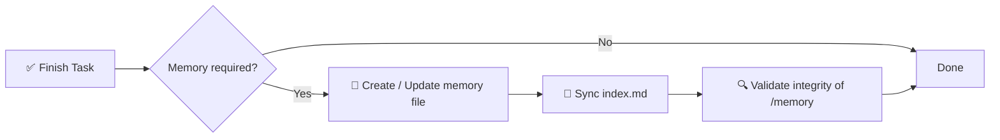

# 🧠 AI 메모리 시스템 명세

> AI 보조 소프트웨어 프로젝트를 위한 구조화되고 강제 가능한 메모리 프레임워크.

[](./memory.md)
[](./memory.md)
[](#-강제-규칙)
[](#-목표)

**AI 세션 사이에 컨텍스트를 잃지 마세요.** 이 저장소는 인덱싱되고 타임스탬프가 있는 Markdown 파일들로 구성된 `/memory/` 디렉토리 기반의 결정적이고 감사 가능한 장기 메모리 계층을 정의합니다.

📖 전체 규범 명세 → [`memory.md`](./memory.md)
⚡ 재사용 가능한 에이전트 스킬 → [`.opencode/skills/ai-memory-system/SKILL.md`](./.opencode/skills/ai-memory-system/SKILL.md)

<!-- README-I18N:START -->
[English](./README.md) | [Español](./README.es.md) | [Português](./README.pt.md) | [Français](./README.fr.md) | [Deutsch](./README.de.md) | [简体中文](./README.zh.md) | [日本語](./README.ja.md) | **한국어** | [Русский](./README.ru.md) | [العربية](./README.ar.md)
<!-- README-I18N:END -->

---

## 📑 목차

- [✨ 왜 필요한가](#-왜-필요한가)
- [💡 핵심 개념](#-핵심-개념)
- [📏 메모리 규칙](#-메모리-규칙)
- [🧾 메모리 파일 형식](#-메모리-파일-형식)
- [📌 메모리를 생성하는 시점](#-메모리를-생성하는-시점)
- [🛡️ 강제 규칙](#️-강제-규칙)
- [🚀 빠른 시작](#-빠른-시작)
- [🤖 스킬로 설치](#-스킬로-설치)
- [💾 예시](#-예시)
- [🎯 목표](#-목표)

---

## ✨ 왜 필요한가

최신 AI 에이전트는 세션 사이에 컨텍스트를 잃습니다. 이 시스템은 **결정적이고 감사 가능한 메모리 계층**으로 이를 해결합니다:

| 기능 | 설명 |
|------------|-------------|
| 🏛️ **결정** | 아키텍처 결정을 근거와 함께 추적 |
| 🔧 **리팩터** | 리팩터와 시스템 변경을 기록 |
| 📜 **히스토리** | 구조화되고 타임스탬프가 있는 프로젝트 히스토리 유지 |
| 🔁 **재현성** | 재현성과 추적 가능성 보장 |

> *“왜 이렇게 했더라?”*는 이제 그만—모든 중요한 변경은 문서화되고, 인덱싱되며, 검색 가능합니다.

---

## 💡 핵심 개념

저장소는 `/memory/` 폴더를 강제하며, 이는 프로젝트의 **장기 메모리** 역할을 합니다.

```
📦 your-repo/
 ┣ 📂 memory/
 ┃ ┣ 📄 index.md                    ← global index (source of truth)
 ┃ ┣ 📄 2026-10-04_22-31_auth-refactor.md
 ┃ ┗ 📄 2026-10-05_09-15_db-schema-v2.md
 ┣ 📄 memory.md                     ← this spec (mandatory rules)
 ┗ 📄 README.md
```

구성 요소:

- **`index.md`** → 글로벌 메모리 인덱스, **유일한 진실 공급원**
- **`*.md` 파일** → 개별 원자적 메모리 항목

---

## 📏 메모리 규칙

### 1. 🗂️ 구조

모든 메모리 파일은 엄격한 형식을 따라야 합니다:

- ✅ 파일당 최대 **200줄**——초과 시 여러 파일로 분할(샤딩)
- ✅ 타임스탬프 파일명 형식:

  ```
  YYYY-MM-DD_HH-MM_<slug>.md
  ```

  > 예: `2026-10-04_22-31_auth-refactor.md`

### 2. 🧭 인덱스 시스템

`index.md` 파일:

- 📋 **모든** 메모리 항목을 나열 (중복 없음, 깨진 링크 없음)
- 🔄 **항상 동기화**되어야 함——변경할 때마다 업데이트
- ⬇️ **내림차순** 정렬 (최신 항목이 먼저)

**형식:**

```md
# MEMORY INDEX

## 2026-10-04

- 22:31 — Auth refactor → ./memory/2026-10-04_22-31_auth-refactor.md
```

---

## 🧾 메모리 파일 형식

> 각 메모리 파일은 반드시 다음 템플릿을 따라야 합니다:

```md
# Title

## Meta
- Date: YYYY-MM-DD
- Time: HH:MM
- Type: feature | fix | refactor | decision | bug | infra
- Scope: file / module / system affected

## Context
Problem or situation description.

## Action
What was done.

## Result
Final outcome.

## Impact
Effect on system or future decisions.

## Follow-up (optional)
Risks or pending tasks.
```

**작성 규칙:**

- 🚫 금지: 빈 텍스트, 플레이스홀더, 맥락 없는 `TBD`·`later`·`pending`
- ✅ 모든 내용은 **구체적이고 검증 가능하며** 향후 디버깅/감사에 유용해야 함

---

## 📌 메모리를 생성하는 시점

다음 경우 메모리 항목이 **필수**입니다:

| ✅ 생성 대상 | 🚫 생성하지 않을 대상 |
|------------------|----------------------|
| 🏛️ 아키텍처 변경 | ✏️ 오타 |
| 🔧 리팩터 | 🎨 포맷/스타일 |
| 🐛 중요한 버그 수정 | 📝 무관한 로그 |
| 🔒 보안 수정 | |
| 🗄️ DB 스키마 업데이트 | |
| ⚙️ 워크플로 또는 자동화 변경 | |
| 💡 중요한 기술적 결정 | |

---

## 🛡️ 강제 규칙

> ⚠️ **모든 작업 후 시스템은 다음을 수행해야 합니다:**



1. 메모리가 필요한지 **판단**
2. 메모리 파일 **생성/업데이트**
3. `index.md` **동기화**
4. `/memory` 무결성 **검증**

❌ **이를 수행하지 않으면 작업 완료가 무효가 됩니다.**

---

## 🚀 빠른 시작

```bash
# 1. Create memory directory
mkdir -p memory

# 2. Create the index (source of truth)
cat > memory/index.md << 'EOF'
# MEMORY INDEX

## 2026-10-05

- 09:15 — Initial setup → ./memory/2026-10-05_09-15_initial-setup.md
EOF

# 3. Create your first memory entry
# File: memory/2026-10-05_09-15_initial-setup.md
# (use the template from 🧾 Memory File Format)
```

**모든 AI 작업 체크리스트:**

- [ ] 아키텍처·DB·보안·워크플로가 변경되었는가? → 메모리 생성
- [ ] 파일명이 `YYYY-MM-DD_HH-MM_<slug>.md`를 따르는가?
- [ ] 파일이 200줄 이하인가?
- [ ] `index.md`가 업데이트되고 내림차순으로 정렬되었는가?

---

## 🤖 스킬로 설치

이 저장소는 바로 사용할 수 있는 **OpenCode / Claude / Agents 스킬**이기도 합니다 (`ai-memory-system`).

```
.opencode/skills/ai-memory-system/
├── SKILL.md                      ← skill definition (frontmatter + workflow)
├── references/
│   ├── memory-template.md        ← copy-paste memory file template
│   └── index-template.md         ← copy-paste index.md example
└── scripts/
    └── validate-memory.sh        ← integrity checker
```

**프로젝트에서 사용:**

```bash
# Option A — copy into your project (OpenCode)
mkdir -p .opencode/skills
cp -r /path/to/this-repo/.opencode/skills/ai-memory-system .opencode/skills/

# Option B — global install (all projects)
mkdir -p ~/.config/opencode/skills
cp -r /path/to/this-repo/.opencode/skills/ai-memory-system ~/.config/opencode/skills/

# Claude-compatible paths also work:
# .claude/skills/ , ~/.claude/skills/ , .agents/skills/ , ~/.agents/skills/
```

**설치 후 검증:**

```bash
bash .opencode/skills/ai-memory-system/scripts/validate-memory.sh --root .
# ✅ memory/ and index.md exist
# ✅ memory system is valid
```

설치 후 에이전트는 `skill` 도구를 통해 자동으로 감지합니다:

```
skill({ name: "ai-memory-system" })
```

> 이 스킬은 전체 [`memory.md`](./memory.md) 명세를 템플릿과 검증이 포함된 회상 → 실행 → 영속화 워크플로로 감싼 것입니다.

---

## 💾 예시

**파일:** `memory/2026-10-04_22-31_auth-refactor.md`

```md
# Auth Refactor to JWT

## Meta
- Date: 2026-10-04
- Time: 22:31
- Type: refactor
- Scope: auth/ module

## Context
Session-based auth caused scaling issues with multiple instances.

## Action
Migrated to stateless JWT with refresh-token rotation.

## Result
Auth is now stateless; login latency -30%.

## Impact
Requires `JWT_SECRET` in env. All future services must validate JWT.

## Follow-up
Rotate secrets every 90 days. Add logout blocklist.
```

그리고 `index.md`에서는:

```md
## 2026-10-04

- 22:31 — Auth refactor to JWT → ./memory/2026-10-04_22-31_auth-refactor.md
```

---

## 🎯 목표

> AI 시스템에 **영속적이고 구조화되며 감사 가능한 메모리 계층**을 제공하여 개발 세션 전반의 추론 연속성을 향상시키는 것.

**원칙:** 📐 결정적 · 🔍 감사 가능 · 🤖 에이전트 강제 가능 · 🕰️ 시간 여행 가능

---

<p align="center">
  <sub><b>기억</b>해야 하는 AI 에이전트를 위해 제작. 🧠✨</sub><br>
  <a href="./memory.md">📖 전체 명세 읽기</a>
</p>

---

<!-- SEO: keywords for GitHub search and Google indexing -->
<!-- ai-agents, ai-memory, llm-memory, llm, context-management, agent-skills, opencode, claude-skills, prompt-engineering, software-architecture, knowledge-management, developer-tools, documentation, traceability, reproducibility -->

<details>
<summary>🏷️ Keywords</summary>

`ai-agents` · `ai-memory` · `llm` · `llm-memory` · `context-management` · `agent-skills` · `opencode` · `claude-skills` · `prompt-engineering` · `software-architecture` · `knowledge-management` · `developer-tools` · `documentation` · `traceability` · `reproducibility`

</details>
