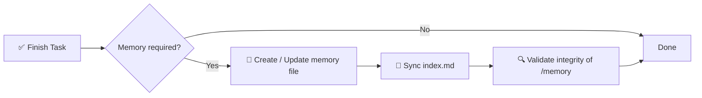

# 🧠 AI Memory System Spec

> A structured, enforceable memory framework for AI-assisted software projects.

[](./memory.md)
[](./memory.md)
[](#-enforcement-rule)
[](#-goal)

**Stop losing context between AI sessions.** This repo defines a deterministic, auditable long-term memory layer based on a `/memory/` directory with indexed, timestamped Markdown files.

📖 Full normative spec → [`memory.md`](./memory.md)
⚡ Reusable agent skill → [`.opencode/skills/ai-memory-system/SKILL.md`](./.opencode/skills/ai-memory-system/SKILL.md)

<!-- README-I18N:START -->
**English** | [Español](./README.es.md) | [Português](./README.pt.md) | [Français](./README.fr.md) | [Deutsch](./README.de.md) | [简体中文](./README.zh.md) | [日本語](./README.ja.md) | [한국어](./README.ko.md) | [Русский](./README.ru.md) | [العربية](./README.ar.md)
<!-- README-I18N:END -->

---

## 📑 Table of Contents

- [✨ Why this exists](#-why-this-exists)
- [💡 Core Concept](#-core-concept)
- [📏 Memory Rules](#-memory-rules)
- [🧾 Memory File Format](#-memory-file-format)
- [📌 When to Create Memory](#-when-to-create-memory)
- [🛡️ Enforcement Rule](#️-enforcement-rule)
- [🚀 Quick Start](#-quick-start)
- [🤖 Install as Skill](#-install-as-skill)
- [💾 Example](#-example)
- [🎯 Goal](#-goal)

---

## ✨ Why this exists

Modern AI agents lose context between sessions. This system solves that with a **deterministic, auditable memory layer** that:

| Capability | Description |
|------------|-------------|
| 🏛️ **Decisions** | Tracks architectural decisions with rationale |
| 🔧 **Refactors** | Records refactors and system changes |
| 📜 **History** | Maintains a structured, timestamped project history |
| 🔁 **Reproducibility** | Enables reproducibility and traceability |

> No more *"why did we do it this way?"* — every important change is documented, indexed, and searchable.

---

## 💡 Core Concept

The repository enforces a `/memory/` folder that acts as the **long-term memory of the project**.

```
📦 your-repo/
 ┣ 📂 memory/
 ┃ ┣ 📄 index.md                    ← global index (source of truth)
 ┃ ┣ 📄 2026-10-04_22-31_auth-refactor.md
 ┃ ┗ 📄 2026-10-05_09-15_db-schema-v2.md
 ┣ 📄 memory.md                     ← this spec (mandatory rules)
 ┗ 📄 README.md
```

It is composed of:

- **`index.md`** → global memory index, the **single source of truth**
- **`*.md` files** → individual, atomic memory entries

---

## 📏 Memory Rules

### 1. 🗂️ Structure

All memory files must follow strict formatting:

- ✅ Max **200 lines** per file — if exceeded, split (shard) into multiple files
- ✅ Timestamped filename format:

  ```
  YYYY-MM-DD_HH-MM_<slug>.md
  ```

  > Example: `2026-10-04_22-31_auth-refactor.md`

### 2. 🧭 Index System

The `index.md` file:

- 📋 Lists **all** memory entries (no duplicates, no dead links)
- 🔄 Must **always be synchronized** — updated after every change
- ⬇️ Ordered **descending** (most recent first)

**Format:**

```md
# MEMORY INDEX

## 2026-10-04

- 22:31 — Auth refactor → ./memory/2026-10-04_22-31_auth-refactor.md
```

---

## 🧾 Memory File Format

> Each memory file must follow this exact template:

```md
# Title

## Meta
- Date: YYYY-MM-DD
- Time: HH:MM
- Type: feature | fix | refactor | decision | bug | infra
- Scope: file / module / system affected

## Context
Problem or situation description.

## Action
What was done.

## Result
Final outcome.

## Impact
Effect on system or future decisions.

## Follow-up (optional)
Risks or pending tasks.
```

**Writing rules:**

- 🚫 Forbidden: empty text, placeholders, `TBD`, `later`, `pending` without context
- ✅ Everything must be **concrete, verifiable, and useful** for future debugging / audit

---

## 📌 When to Create Memory

A memory entry is **required** when:

| ✅ DO create for | 🚫 DO NOT create for |
|------------------|----------------------|
| 🏛️ Architecture changes | ✏️ Typos |
| 🔧 Refactors | 🎨 Formatting / styling |
| 🐛 Important bug fixes | 📝 Irrelevant logs |
| 🔒 Security modifications | |
| 🗄️ Database schema updates | |
| ⚙️ Workflow or automation changes | |
| 💡 Major technical decisions | |

---

## 🛡️ Enforcement Rule

> ⚠️ **After every task, the system must:**



1. **Determine** if memory is required
2. **Create / update** memory file
3. **Sync** `index.md`
4. **Validate** integrity of `/memory`

❌ **Failure to do so invalidates the task completion.**

---

## 🚀 Quick Start

```bash
# 1. Create memory directory
mkdir -p memory

# 2. Create the index (source of truth)
cat > memory/index.md << 'EOF'
# MEMORY INDEX

## 2026-10-05

- 09:15 — Initial setup → ./memory/2026-10-05_09-15_initial-setup.md
EOF

# 3. Create your first memory entry
# File: memory/2026-10-05_09-15_initial-setup.md
# (use the template from 🧾 Memory File Format)
```

**Checklist for every AI task:**

- [ ] Did architecture, DB, security, or workflow change? → create memory
- [ ] Filename follows `YYYY-MM-DD_HH-MM_<slug>.md`?
- [ ] File ≤ 200 lines?
- [ ] `index.md` updated and sorted descending?

---

## 🤖 Install as Skill

This repo is also a ready-to-use **OpenCode / Claude / Agents skill** (`ai-memory-system`).

```
.opencode/skills/ai-memory-system/
├── SKILL.md                      ← skill definition (frontmatter + workflow)
├── references/
│   ├── memory-template.md        ← copy-paste memory file template
│   └── index-template.md         ← copy-paste index.md example
└── scripts/
    └── validate-memory.sh        ← integrity checker
```

**Use in your project:**

```bash
# Option A — copy into your project (OpenCode)
mkdir -p .opencode/skills
cp -r /path/to/this-repo/.opencode/skills/ai-memory-system .opencode/skills/

# Option B — global install (all projects)
mkdir -p ~/.config/opencode/skills
cp -r /path/to/this-repo/.opencode/skills/ai-memory-system ~/.config/opencode/skills/

# Claude-compatible paths also work:
# .claude/skills/ , ~/.claude/skills/ , .agents/skills/ , ~/.agents/skills/
```

**Validate after install:**

```bash
bash .opencode/skills/ai-memory-system/scripts/validate-memory.sh --root .
# ✅ memory/ and index.md exist
# ✅ memory system is valid
```

Once installed, the agent discovers it automatically via the `skill` tool:

```
skill({ name: "ai-memory-system" })
```

> The skill wraps the full [`memory.md`](./memory.md) spec into Recall → Act → Persist workflow with templates and validation.

---

## 💾 Example

**File:** `memory/2026-10-04_22-31_auth-refactor.md`

```md
# Auth Refactor to JWT

## Meta
- Date: 2026-10-04
- Time: 22:31
- Type: refactor
- Scope: auth/ module

## Context
Session-based auth caused scaling issues with multiple instances.

## Action
Migrated to stateless JWT with refresh-token rotation.

## Result
Auth is now stateless; login latency -30%.

## Impact
Requires `JWT_SECRET` in env. All future services must validate JWT.

## Follow-up
Rotate secrets every 90 days. Add logout blocklist.
```

And in `index.md`:

```md
## 2026-10-04

- 22:31 — Auth refactor to JWT → ./memory/2026-10-04_22-31_auth-refactor.md
```

---

## 🎯 Goal

> To provide AI systems with a **persistent, structured, and auditable memory layer** that improves reasoning continuity across development sessions.

**Principles:** 📐 Deterministic · 🔍 Auditable · 🤖 Agent-enforceable · 🕰️ Time-travelable

---

<p align="center">
  <sub>Built for AI agents that need to <b>remember</b>. 🧠✨</sub><br>
  <a href="./memory.md">📖 Read the full spec</a>
</p>

---

<!-- SEO: keywords for GitHub search and Google indexing -->
<!-- ai-agents, ai-memory, llm-memory, llm, context-management, agent-skills, opencode, claude-skills, prompt-engineering, software-architecture, knowledge-management, developer-tools, documentation, traceability, reproducibility -->

<details>
<summary>🏷️ Keywords</summary>

`ai-agents` · `ai-memory` · `llm` · `llm-memory` · `context-management` · `agent-skills` · `opencode` · `claude-skills` · `prompt-engineering` · `software-architecture` · `knowledge-management` · `developer-tools` · `documentation` · `traceability` · `reproducibility`

</details>
