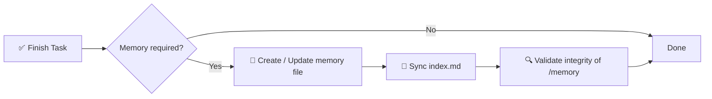

# 🧠 Especificação do Sistema de Memória IA

> Um framework de memória estruturado e obrigatório para projetos de software assistidos por IA.

[](./memory.md)
[](./memory.md)
[](#-regra-de-cumprimento)
[](#-objetivo)

**Pare de perder contexto entre sessões de IA.** Este repo define uma camada de memória determinística, auditável e de longo prazo baseada em um diretório `/memory/` com arquivos Markdown indexados e com marcação de tempo — mais uma **memória global** compartilhada (`~/.agents/memory/`) que acompanha você em cada projeto, repo e sessão.

📖 Especificação normativa completa → [`memory.md`](./memory.md)
⚡ Skill reutilizável para agentes (`ai-memory-system`) → [`.agents/skills/ai-memory-system/SKILL.md`](./.agents/skills/ai-memory-system/SKILL.md) — funciona com **Codex, Claude Code, OpenCode, Gemini CLI, Cursor**.

<!-- README-I18N:START -->
[English](./README.md) | [Español](./README.es.md) | **Português** | [Français](./README.fr.md) | [Deutsch](./README.de.md) | [简体中文](./README.zh.md) | [日本語](./README.ja.md) | [한국어](./README.ko.md) | [Русский](./README.ru.md) | [العربية](./README.ar.md)
<!-- README-I18N:END -->

---

## 📑 Índice

- [✨ Por que existe](#-por-que-existe)
- [💡 Conceito central](#-conceito-central)
- [🌍 Memória de projeto vs global](#-memória-de-projeto-vs-global)
- [📏 Regras de memória](#-regras-de-memória)
- [🧾 Formato do arquivo de memória](#-formato-do-arquivo-de-memória)
- [📌 Quando criar memória](#-quando-criar-memória)
- [🛡️ Regra de cumprimento](#️-regra-de-cumprimento)
- [🚀 Início rápido](#-início-rápido)
- [🤖 Instalar como skill](#-instalar-como-skill)
- [💾 Exemplo](#-exemplo)
- [🎯 Objetivo](#-objetivo)

---

## ✨ Por que existe

Agentes de IA modernos perdem contexto entre sessões. Este sistema resolve isso com uma **camada de memória determinística e auditável** que:

| Capacidade | Descrição |
|------------|-------------|
| 🏛️ **Decisões** | Registra decisões arquiteturais com justificativa |
| 🔧 **Refactors** | Registra refactors e mudanças do sistema |
| 📜 **Histórico** | Mantém um histórico de projeto estruturado e com marcação de tempo |
| 🔁 **Reprodutibilidade** | Permite reprodutibilidade e rastreabilidade |
| 🌍 **Memória compartilhada** | Armazenamento global (`~/.agents/memory/`) reutiliza aprendizados em TODOS os projetos e repos |

> Chega de *"por que fizemos assim?"* — cada mudança importante está documentada, indexada e pesquisável.

---

## 💡 Conceito central

O repositório exige uma pasta `/memory/` que atua como a **memória de longo prazo do projeto**.

```
📦 your-repo/
 ┣ 📂 memory/
 ┃ ┣ 📄 index.md                    ← global index (source of truth)
 ┃ ┣ 📄 2026-10-04_22-31_auth-refactor.md
 ┃ ┗ 📄 2026-10-05_09-15_db-schema-v2.md
 ┣ 📄 memory.md                     ← this spec (mandatory rules)
 ┗ 📄 README.md
```

Ela é composta de:

- **`index.md`** → índice global de memória, a **única fonte da verdade**
- **arquivos `*.md`** → entradas de memória individuais e atômicas

---

## 🌍 Memória de projeto vs global

Duas camadas. O agente sempre lê **ambas**:

| Camada | Localização | Conteúdo |
|-------|----------|----------|
| 📁 PROJETO | `./memory/` em cada repo | Específico do repo: arquitetura, refactors, bugs deste repo |
| 🌍 GLOBAL | `~/.agents/memory/` | Compartilhado entre TODOS os repos/sessões: decisões, padrões e preferências reutilizáveis |

**Regra de roteamento:** específico do repo → PROJETO (padrão). Reutilizável em outro lugar → GLOBAL (`new-memory.sh --global`). Na dúvida → PROJETO.

Busque em ambas de uma vez:

```bash
bash $SKILL_DIR/scripts/search-memory.sh <keyword> --root .
```

---

## 📏 Regras de memória

### 1. 🗂️ Estrutura

Todos os arquivos de memória devem seguir formatação estrita:

- ✅ Máx. **200 linhas** por arquivo — se exceder, divida (fragmente) em vários arquivos
- ✅ Formato de nome com marcação de tempo:

  ```
  YYYY-MM-DD_HH-MM_<slug>.md
  ```

  > Exemplo: `2026-10-04_22-31_auth-refactor.md`

### 2. 🧭 Sistema de índice

O arquivo `index.md`:

- 📋 Lista **todas** as entradas de memória (sem duplicatas, sem links quebrados)
- 🔄 Deve estar **sempre sincronizado** — atualizado após cada mudança
- ⬇️ Ordenado de forma **decrescente** (mais recente primeiro)

**Formato:**

```md
# MEMORY INDEX

## 2026-10-04

- 22:31 — Auth refactor → ./memory/2026-10-04_22-31_auth-refactor.md
```

---

## 🧾 Formato do arquivo de memória

> Cada arquivo de memória deve seguir exatamente este modelo:

```md
# Title

## Meta
- Date: YYYY-MM-DD
- Time: HH:MM
- Type: feature | fix | refactor | decision | bug | infra
- Scope: file / module / system affected

## Context
Problem or situation description.

## Action
What was done.

## Result
Final outcome.

## Impact
Effect on system or future decisions.

## Follow-up (optional)
Risks or pending tasks.
```

**Regras de escrita:**

- 🚫 Proibido: texto vazio, placeholders, `TBD`, `later`, `pending` sem contexto
- ✅ Tudo deve ser **concreto, verificável e útil** para depurações / auditorias futuras

> Modelos prontos (memória, decisão, bug, refactor, índice) na pasta `references/` do skill.

---

## 📌 Quando criar memória

Uma entrada de memória é **obrigatória** quando:

| ✅ CRIAR para | 🚫 NÃO criar para |
|------------------|----------------------|
| 🏛️ Mudanças de arquitetura | ✏️ Erros de digitação |
| 🔧 Refactors | 🎨 Formatação / estilo |
| 🐛 Correções importantes de bugs | 📝 Logs irrelevantes |
| 🔒 Modificações de segurança | |
| 🗄️ Atualizações de esquema de BD | |
| ⚙️ Mudanças de fluxo ou automação | |
| 💡 Decisões técnicas importantes | |

---

## 🛡️ Regra de cumprimento

> ⚠️ **Após cada tarefa, o sistema deve:**



1. **Determinar** se a memória é necessária
2. **Criar / atualizar** o arquivo de memória
3. **Sincronizar** o `index.md`
4. **Validar** a integridade de `/memory`

❌ **Não fazer isso invalida a conclusão da tarefa.**

---

## 🚀 Início rápido

```bash
# 1. Create memory directory
mkdir -p memory

# 2. Create the index (source of truth)
cat > memory/index.md << 'EOF'
# MEMORY INDEX

## 2026-10-05

- 09:15 — Initial setup → ./memory/2026-10-05_09-15_initial-setup.md
EOF

# 3. Create your first memory entry
# File: memory/2026-10-05_09-15_initial-setup.md
# (use the template from 🧾 Memory File Format)
```

**Checklist para cada tarefa de IA:**

- [ ] Arquitetura, BD, segurança ou fluxo mudou? → criar memória
- [ ] O nome segue `YYYY-MM-DD_HH-MM_<slug>.md`?
- [ ] O arquivo tem ≤ 200 linhas?
- [ ] `index.md` atualizado e ordenado de forma decrescente?
- [ ] Reutilizável em outros repos? → salve globalmente com `new-memory.sh --global` (vai para `~/.agents/memory/`)

---

## 🤖 Instalar como skill

Este repo é um **skill multi-agente** pronto para uso (`ai-memory-system`) para **Codex, Claude Code, OpenCode, Gemini CLI, Cursor** (padrão Agent Skills: `SKILL.md`).

**Estrutura** (`.agents/` é canônico — nunca edite um espelho diretamente):

```
.agents/skills/ai-memory-system/     ← canonical (Codex, Gemini alias, OpenCode)
.claude/skills/ai-memory-system/     ← mirror (Claude Code)
.gemini/skills/ai-memory-system/     ← mirror (Gemini CLI)
.opencode/skills/ai-memory-system/   ← mirror (OpenCode)
├── SKILL.md                         ← skill definition (Recall → Act → Persist)
├── references/                      ← memory, decision, bug, refactor, index templates
└── scripts/                         ← new-memory, validate-memory, search-memory, install-global, sync-vendors
```

**Instalação global (recomendado — skill + `/memory` em CADA projeto):**

```bash
bash .agents/skills/ai-memory-system/scripts/install-global.sh --force
# Restart your agent, then type /memory anywhere
```

Instala o skill em `~/.agents/skills/`, `~/.claude/skills/`, `~/.gemini/skills/`, `~/.config/opencode/skills/`, `~/.cursor/skills/`, o comando `/memory` para OpenCode / Claude / Gemini, e cria o armazenamento compartilhado `~/.agents/memory/`.

**Por projeto (somente este repo):** copie `.agents/skills/ai-memory-system` para o diretório de skills do seu agente — veja `AGENTS.md` §3 para todos os caminhos.

**Comando slash:**

- `/memory` → lembrar (projeto + global)
- `/memory save <descrição>` → persistir (roteia PROJETO vs GLOBAL)

**Valide após instalar:**

```bash
bash $SKILL_DIR/scripts/validate-memory.sh --root .                  # project memory
bash $SKILL_DIR/scripts/validate-memory.sh --memdir ~/.agents/memory # global memory
# ✅ memory system is valid
```

> O skill encapsula a especificação completa [`memory.md`](./memory.md) em um fluxo Lembrar → Agir → Persistir com modelos e validação. Instruções para agentes: [`AGENTS.md`](./AGENTS.md).

---

## 💾 Exemplo

**Arquivo:** `memory/2026-10-04_22-31_auth-refactor.md`

```md
# Auth Refactor to JWT

## Meta
- Date: 2026-10-04
- Time: 22:31
- Type: refactor
- Scope: auth/ module

## Context
Session-based auth caused scaling issues with multiple instances.

## Action
Migrated to stateless JWT with refresh-token rotation.

## Result
Auth is now stateless; login latency -30%.

## Impact
Requires `JWT_SECRET` in env. All future services must validate JWT.

## Follow-up
Rotate secrets every 90 days. Add logout blocklist.
```

E em `index.md`:

```md
## 2026-10-04

- 22:31 — Auth refactor to JWT → ./memory/2026-10-04_22-31_auth-refactor.md
```

---

## 🎯 Objetivo

> Fornecer aos sistemas de IA uma **camada de memória persistente, estruturada e auditável** que melhore a continuidade do raciocínio entre sessões de desenvolvimento.

**Princípios:** 📐 Determinístico · 🔍 Auditável · 🤖 Aplicável por agentes · 🕰️ Viagem no tempo

---

<p align="center">
  <sub>Feito para agentes de IA que precisam <b>lembrar</b>. 🧠✨</sub><br>
  <a href="./memory.md">📖 Ler a especificação completa</a>
</p>

---

<!-- SEO: keywords for GitHub search and Google indexing -->
<!-- ai-agents, ai-memory, llm-memory, llm, context-management, agent-skills, opencode, claude-skills, prompt-engineering, software-architecture, knowledge-management, developer-tools, documentation, traceability, reproducibility -->

<details>
<summary>🏷️ Keywords</summary>

`ai-agents` · `ai-memory` · `llm` · `llm-memory` · `context-management` · `agent-skills` · `opencode` · `claude-skills` · `prompt-engineering` · `software-architecture` · `knowledge-management` · `developer-tools` · `documentation` · `traceability` · `reproducibility`

</details>
