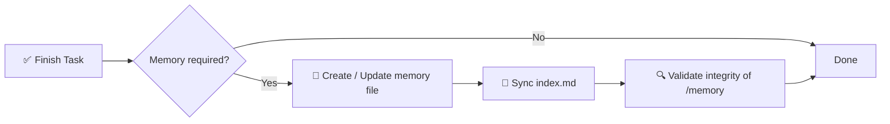

# 🧠 Спецификация системы памяти ИИ

> Структурированный, обязательный к исполнению фреймворк памяти для ИИ-ассистированных программных проектов.

[](./memory.md)
[](./memory.md)
[](#-правило-исполнения)
[](#-цель)

**Хватит терять контекст между сессиями ИИ.** Этот репозиторий определяет детерминированный, аудируемый слой долговременной памяти на основе директории `/memory/` с индексированными Markdown-файлами с временными метками — плюс общую **глобальную память** (`~/.agents/memory/`), которая следует за вами в каждом проекте, репозитории и сессии.

📖 Полная нормативная спецификация → [`memory.md`](./memory.md)
⚡ Переиспользуемый навык агента (`ai-memory-system`) → [`.agents/skills/ai-memory-system/SKILL.md`](./.agents/skills/ai-memory-system/SKILL.md) — работает с **Codex, Claude Code, OpenCode, Gemini CLI, Cursor**.

<!-- README-I18N:START -->
[English](./README.md) | [Español](./README.es.md) | [Português](./README.pt.md) | [Français](./README.fr.md) | [Deutsch](./README.de.md) | [简体中文](./README.zh.md) | [日本語](./README.ja.md) | [한국어](./README.ko.md) | **Русский** | [العربية](./README.ar.md)
<!-- README-I18N:END -->

---

## 📑 Содержание

- [✨ Зачем это нужно](#-зачем-это-нужно)
- [💡 Основная концепция](#-основная-концепция)
- [🌍 Память проекта vs глобальная](#-память-проекта-vs-глобальная)
- [📏 Правила памяти](#-правила-памяти)
- [🧾 Формат файла памяти](#-формат-файла-памяти)
- [📌 Когда создавать память](#-когда-создавать-память)
- [🛡️ Правило исполнения](#️-правило-исполнения)
- [🚀 Быстрый старт](#-быстрый-старт)
- [🤖 Установка как навык](#-установка-как-навык)
- [💾 Пример](#-пример)
- [🎯 Цель](#-цель)

---

## ✨ Зачем это нужно

Современные ИИ-агенты теряют контекст между сессиями. Эта система решает проблему с помощью **детерминированного, аудируемого слоя памяти**, который:

| Возможность | Описание |
|------------|-------------|
| 🏛️ **Решения** | Отслеживает архитектурные решения с обоснованием |
| 🔧 **Рефакторы** | Фиксирует рефакторы и изменения системы |
| 📜 **История** | Ведёт структурированную историю проекта с временными метками |
| 🔁 **Воспроизводимость** | Обеспечивает воспроизводимость и трассируемость |
| 🌍 **Общая память** | Глобальное хранилище (`~/.agents/memory/`) переиспользует знания во ВСЕХ проектах и репозиториях |

> Больше никакого *«а почему мы сделали именно так?»* — каждое важное изменение задокументировано, проиндексировано и доступно для поиска.

---

## 💡 Основная концепция

Репозиторий требует папку `/memory/`, которая выступает **долговременной памятью проекта**.

```
📦 your-repo/
 ┣ 📂 memory/
 ┃ ┣ 📄 index.md                    ← global index (source of truth)
 ┃ ┣ 📄 2026-10-04_22-31_auth-refactor.md
 ┃ ┗ 📄 2026-10-05_09-15_db-schema-v2.md
 ┣ 📄 memory.md                     ← this spec (mandatory rules)
 ┗ 📄 README.md
```

Она состоит из:

- **`index.md`** → глобальный индекс памяти, **единственный источник правды**
- **файлов `*.md`** → отдельных атомарных записей памяти

---

## 🌍 Память проекта vs глобальная

Два слоя. Агент всегда читает **оба**:

| Слой | Расположение | Содержимое |
|-------|----------|----------|
| 📁 ПРОЕКТ | `./memory/` в каждом репозитории | Специфика репозитория: архитектура, рефакторы, баги этого репозитория |
| 🌍 ГЛОБАЛЬНАЯ | `~/.agents/memory/` | Общая для ВСЕХ репозиториев/сессий: переиспользуемые решения, паттерны, предпочтения |

**Правило маршрутизации:** специфика репозитория → ПРОЕКТ (по умолчанию). Переиспользуемое в других местах → ГЛОБАЛЬНАЯ (`new-memory.sh --global`). При сомнениях → ПРОЕКТ.

Искать в обоих сразу:

```bash
bash $SKILL_DIR/scripts/search-memory.sh <keyword> --root .
```

---

## 📏 Правила памяти

### 1. 🗂️ Структура

Все файлы памяти должны следовать строгому форматированию:

- ✅ Макс. **200 строк** на файл — при превышении разбить (шардировать) на несколько файлов
- ✅ Формат имени с временной меткой:

  ```
  YYYY-MM-DD_HH-MM_<slug>.md
  ```

  > Пример: `2026-10-04_22-31_auth-refactor.md`

### 2. 🧭 Система индекса

Файл `index.md`:

- 📋 Перечисляет **все** записи памяти (без дубликатов, без битых ссылок)
- 🔄 Должен **всегда быть синхронизирован** — обновляется после каждого изменения
- ⬇️ Упорядочен **по убыванию** (сначала самые свежие)

**Формат:**

```md
# MEMORY INDEX

## 2026-10-04

- 22:31 — Auth refactor → ./memory/2026-10-04_22-31_auth-refactor.md
```

---

## 🧾 Формат файла памяти

> Каждый файл памяти должен точно следовать этому шаблону:

```md
# Title

## Meta
- Date: YYYY-MM-DD
- Time: HH:MM
- Type: feature | fix | refactor | decision | bug | infra
- Scope: file / module / system affected

## Context
Problem or situation description.

## Action
What was done.

## Result
Final outcome.

## Impact
Effect on system or future decisions.

## Follow-up (optional)
Risks or pending tasks.
```

**Правила написания:**

- 🚫 Запрещено: пустой текст, плейсхолдеры, `TBD`, `later`, `pending` без контекста
- ✅ Всё должно быть **конкретным, проверяемым и полезным** для будущей отладки / аудита

> Готовые шаблоны (память, решение, баг, рефактор, индекс) в папке `references/` навыка.

---

## 📌 Когда создавать память

Запись памяти **обязательна**, когда:

| ✅ СОЗДАВАТЬ для | 🚫 НЕ создавать для |
|------------------|----------------------|
| 🏛️ Изменений архитектуры | ✏️ Опечаток |
| 🔧 Рефакторов | 🎨 Форматирования / стиля |
| 🐛 Важных исправлений багов | 📝 Нерелевантных логов |
| 🔒 Изменений безопасности | |
| 🗄️ Обновлений схемы БД | |
| ⚙️ Изменений workflow или автоматизации | |
| 💡 Важных технических решений | |

---

## 🛡️ Правило исполнения

> ⚠️ **После каждой задачи система обязана:**



1. **Определить**, требуется ли память
2. **Создать / обновить** файл памяти
3. **Синхронизировать** `index.md`
4. **Проверить** целостность `/memory`

❌ **Невыполнение аннулирует завершение задачи.**

---

## 🚀 Быстрый старт

```bash
# 1. Create memory directory
mkdir -p memory

# 2. Create the index (source of truth)
cat > memory/index.md << 'EOF'
# MEMORY INDEX

## 2026-10-05

- 09:15 — Initial setup → ./memory/2026-10-05_09-15_initial-setup.md
EOF

# 3. Create your first memory entry
# File: memory/2026-10-05_09-15_initial-setup.md
# (use the template from 🧾 Memory File Format)
```

**Чеклист для каждой задачи ИИ:**

- [ ] Архитектура, БД, безопасность или workflow изменились? → создать память
- [ ] Имя следует `YYYY-MM-DD_HH-MM_<slug>.md`?
- [ ] Файл ≤ 200 строк?
- [ ] `index.md` обновлён и отсортирован по убыванию?
- [ ] Переиспользуемо в других репозиториях? → сохраните глобально через `new-memory.sh --global` (попадёт в `~/.agents/memory/`)

---

## 🤖 Установка как навык

Этот репозиторий — готовый к использованию **мультиагентный навык** (`ai-memory-system`) для **Codex, Claude Code, OpenCode, Gemini CLI, Cursor** (стандарт Agent Skills: `SKILL.md`).

**Структура** (`.agents/` — канон, зеркала напрямую не редактировать):

```
.agents/skills/ai-memory-system/     ← canonical (Codex, Gemini alias, OpenCode)
.claude/skills/ai-memory-system/     ← mirror (Claude Code)
.gemini/skills/ai-memory-system/     ← mirror (Gemini CLI)
.opencode/skills/ai-memory-system/   ← mirror (OpenCode)
├── SKILL.md                         ← skill definition (Recall → Act → Persist)
├── references/                      ← memory, decision, bug, refactor, index templates
└── scripts/                         ← new-memory, validate-memory, search-memory, install-global, sync-vendors
```

**Глобальная установка (рекомендуется — навык + `/memory` в КАЖДОМ проекте):**

```bash
bash .agents/skills/ai-memory-system/scripts/install-global.sh --force
# Restart your agent, then type /memory anywhere
```

Устанавливает навык в `~/.agents/skills/`, `~/.claude/skills/`, `~/.gemini/skills/`, `~/.config/opencode/skills/`, `~/.cursor/skills/`, команду `/memory` для OpenCode / Claude / Gemini и создаёт общее хранилище `~/.agents/memory/`.

**На проект (только этот репозиторий):** скопируйте `.agents/skills/ai-memory-system` в директорию навыков вашего агента — все пути см. в `AGENTS.md` §3.

**Слэш-команда:**

- `/memory` → вспомнить (проект + глобальная)
- `/memory save <описание>` → сохранить (маршрут ПРОЕКТ vs ГЛОБАЛЬНАЯ)

**Проверка после установки:**

```bash
bash $SKILL_DIR/scripts/validate-memory.sh --root .                  # project memory
bash $SKILL_DIR/scripts/validate-memory.sh --memdir ~/.agents/memory # global memory
# ✅ memory system is valid
```

> Навык оборачивает полную спецификацию [`memory.md`](./memory.md) в workflow Вспомнить → Действовать → Сохранить с шаблонами и валидацией. Инструкции для агентов: [`AGENTS.md`](./AGENTS.md).

---

## 💾 Пример

**Файл:** `memory/2026-10-04_22-31_auth-refactor.md`

```md
# Auth Refactor to JWT

## Meta
- Date: 2026-10-04
- Time: 22:31
- Type: refactor
- Scope: auth/ module

## Context
Session-based auth caused scaling issues with multiple instances.

## Action
Migrated to stateless JWT with refresh-token rotation.

## Result
Auth is now stateless; login latency -30%.

## Impact
Requires `JWT_SECRET` in env. All future services must validate JWT.

## Follow-up
Rotate secrets every 90 days. Add logout blocklist.
```

А в `index.md`:

```md
## 2026-10-04

- 22:31 — Auth refactor to JWT → ./memory/2026-10-04_22-31_auth-refactor.md
```

---

## 🎯 Цель

> Дать ИИ-системам **постоянный, структурированный и аудируемый слой памяти**, улучшающий непрерывность рассуждений между сессиями разработки.

**Принципы:** 📐 Детерминированность · 🔍 Аудируемость · 🤖 Принудительность агентами · 🕰️ Путешествия во времени

---

<p align="center">
  <sub>Создано для ИИ-агентов, которым нужно <b>помнить</b>. 🧠✨</sub><br>
  <a href="./memory.md">📖 Читать полную спецификацию</a>
</p>

---

<!-- SEO: keywords for GitHub search and Google indexing -->
<!-- ai-agents, ai-memory, llm-memory, llm, context-management, agent-skills, opencode, claude-skills, prompt-engineering, software-architecture, knowledge-management, developer-tools, documentation, traceability, reproducibility -->

<details>
<summary>🏷️ Keywords</summary>

`ai-agents` · `ai-memory` · `llm` · `llm-memory` · `context-management` · `agent-skills` · `opencode` · `claude-skills` · `prompt-engineering` · `software-architecture` · `knowledge-management` · `developer-tools` · `documentation` · `traceability` · `reproducibility`

</details>
