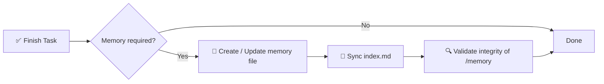

# 🧠 AI 记忆系统规范

> 面向 AI 辅助软件项目的结构化、可强制执行的记忆框架。

[](./memory.md)
[](./memory.md)
[](#-执行规则)
[](#-目标)

<p align="center">
  
</p>

**不再在 AI 会话之间丢失上下文。** 本仓库基于 `/memory/` 目录，通过带索引、带时间戳的 Markdown 文件，定义了一个确定性的、可审计的长期记忆层——外加一个共享的**全局记忆**（`~/.agents/memory/`），在每个项目、仓库和会话中跟随你。

📖 完整规范 → [`memory.md`](./memory.md)
⚡ 可复用的 Agent 技能（`ai-memory-system`）→ [`.agents/skills/ai-memory-system/SKILL.md`](./.agents/skills/ai-memory-system/SKILL.md)——适用于 **Codex、Claude Code、OpenCode、Gemini CLI、Cursor**。

<!-- README-I18N:START -->
[English](./README.md) | [Español](./README.es.md) | [Português](./README.pt.md) | [Français](./README.fr.md) | [Deutsch](./README.de.md) | **简体中文** | [日本語](./README.ja.md) | [한국어](./README.ko.md) | [Русский](./README.ru.md) | [العربية](./README.ar.md)
<!-- README-I18N:END -->

---

## 📑 目录

- [✨ 为什么需要它](#-为什么需要它)
- [💡 核心概念](#-核心概念)
- [🌍 项目记忆与全局记忆](#-项目记忆与全局记忆)
- [📏 记忆规则](#-记忆规则)
- [🧾 记忆文件格式](#-记忆文件格式)
- [📌 何时创建记忆](#-何时创建记忆)
- [🛡️ 执行规则](#️-执行规则)
- [🚀 快速开始](#-快速开始)
- [🤖 作为技能安装](#-作为技能安装)
- [💾 示例](#-示例)
- [🎯 目标](#-目标)

---

## ✨ 为什么需要它

现代 AI 智能体在会话之间会丢失上下文。本系统通过**确定性的、可审计的记忆层**解决这一问题，它可以：

| 能力 | 描述 |
|------------|-------------|
| 🏛️ **决策** | 跟踪架构决策及其理由 |
| 🔧 **重构** | 记录重构和系统变更 |
| 📜 **历史** | 维护结构化的、带时间戳的项目历史 |
| 🔁 **可复现性** | 实现可复现性和可追溯性 |
| 🌍 **共享记忆** | 全局存储（`~/.agents/memory/`），在**所有**项目和仓库中复用经验 |

> 不再有*“我们当时为什么这样做？”*——每一项重要变更都有文档、可索引、可搜索。

---

## 💡 核心概念

本仓库强制要求一个 `/memory/` 文件夹，作为项目的**长期记忆**。

```
📦 your-repo/
 ┣ 📂 memory/
 ┃ ┣ 📄 index.md                    ← global index (source of truth)
 ┃ ┣ 📄 2026-10-04_22-31_auth-refactor.md
 ┃ ┗ 📄 2026-10-05_09-15_db-schema-v2.md
 ┣ 📄 memory.md                     ← this spec (mandatory rules)
 ┗ 📄 README.md
```

它由以下部分组成：

- **`index.md`** → 全局记忆索引，**唯一的事实来源**
- **`*.md` 文件** → 独立的、原子的记忆条目

---

## 🌍 项目记忆与全局记忆

两层。智能体始终读取**两者**：

| 层 | 位置 | 内容 |
|-------|----------|----------|
| 📁 项目 | 每个仓库的 `./memory/` | 仓库专属：本仓库的架构、重构、缺陷 |
| 🌍 全局 | `~/.agents/memory/` | 在**所有**仓库/会话间共享：可复用的决策、模式和偏好 |

**路由规则：** 仓库专属 → 项目（默认）。别处可复用 → 全局（`new-memory.sh --global`）。不确定 → 项目。

同时搜索两者：

```bash
bash $SKILL_DIR/scripts/search-memory.sh <keyword> --root .
```

---

## 📏 记忆规则

### 1. 🗂️ 结构

所有记忆文件必须遵循严格的格式：

- ✅ 每个文件最多 **200 行**——如超出，请拆分（分片）为多个文件
- ✅ 带时间戳的文件名格式：

  ```
  YYYY-MM-DD_HH-MM_<slug>.md
  ```

  > 示例：`2026-10-04_22-31_auth-refactor.md`

### 2. 🧭 索引系统

`index.md` 文件：

- 📋 列出**所有**记忆条目（无重复、无死链）
- 🔄 必须**始终保持同步**——每次变更后更新
- ⬇️ 按**降序**排列（最新的在前）

**格式：**

```md
# MEMORY INDEX

## 2026-10-04

- 22:31 — Auth refactor → ./memory/2026-10-04_22-31_auth-refactor.md
```

---

## 🧾 记忆文件格式

> 每个记忆文件必须严格遵循以下模板：

```md
# Title

## Meta
- Date: YYYY-MM-DD
- Time: HH:MM
- Type: feature | fix | refactor | decision | bug | infra
- Scope: file / module / system affected

## Context
Problem or situation description.

## Action
What was done.

## Result
Final outcome.

## Impact
Effect on system or future decisions.

## Follow-up (optional)
Risks or pending tasks.
```

**写作规则：**

- 🚫 禁止：空文本、占位符、无上下文的 `TBD`、`later`、`pending`
- ✅ 所有内容必须**具体、可验证、有用**，便于未来的调试/审计

> 现成的模板（记忆、决策、缺陷、重构、索引）位于技能的 `references/` 文件夹中。

---

## 📌 何时创建记忆

出现以下情况时**必须**创建记忆条目：

| ✅ 应该创建 | 🚫 不应创建 |
|------------------|----------------------|
| 🏛️ 架构变更 | ✏️ 拼写错误 |
| 🔧 重构 | 🎨 格式/样式 |
| 🐛 重要缺陷修复 | 📝 无关日志 |
| 🔒 安全修改 | |
| 🗄️ 数据库结构更新 | |
| ⚙️ 工作流或自动化变更 | |
| 💡 重要技术决策 | |

---

## 🛡️ 执行规则

> ⚠️ **每次任务完成后，系统必须：**



1. **判断**是否需要记忆
2. **创建/更新**记忆文件
3. **同步** `index.md`
4. **验证** `/memory` 的完整性

❌ **未执行上述步骤则视为任务未完成。**

---

## 🚀 快速开始

```bash
# 1. Create memory directory
mkdir -p memory

# 2. Create the index (source of truth)
cat > memory/index.md << 'EOF'
# MEMORY INDEX

## 2026-10-05

- 09:15 — Initial setup → ./memory/2026-10-05_09-15_initial-setup.md
EOF

# 3. Create your first memory entry
# File: memory/2026-10-05_09-15_initial-setup.md
# (use the template from 🧾 Memory File Format)
```

**每个 AI 任务的检查清单：**

- [ ] 架构、数据库、安全或工作流发生变化？→ 创建记忆
- [ ] 文件名符合 `YYYY-MM-DD_HH-MM_<slug>.md`？
- [ ] 文件 ≤ 200 行？
- [ ] `index.md` 已更新并按降序排列？
- [ ] 可在其他仓库复用？→ 用 `new-memory.sh --global` 全局保存（存入 `~/.agents/memory/`）

---

## 🤖 作为技能安装

本仓库是一个开箱即用的**多智能体技能**（`ai-memory-system`），适用于 **Codex、Claude Code、OpenCode、Gemini CLI、Cursor**（Agent Skills 标准：`SKILL.md`）。

**布局**（`.agents/` 为权威来源——切勿直接编辑镜像）：

```
.agents/skills/ai-memory-system/     ← canonical (Codex, Gemini alias, OpenCode)
.claude/skills/ai-memory-system/     ← mirror (Claude Code)
.gemini/skills/ai-memory-system/     ← mirror (Gemini CLI)
.opencode/skills/ai-memory-system/   ← mirror (OpenCode)
├── SKILL.md                         ← skill definition (Recall → Act → Persist)
├── references/                      ← memory, decision, bug, refactor, index templates
└── scripts/                         ← new-memory, validate-memory, search-memory, install-global, sync-vendors
```

**全局安装（推荐——在*每个*项目中使用 skill + `/memory`）：**

```bash
bash .agents/skills/ai-memory-system/scripts/install-global.sh --force
# Restart your agent, then type /memory anywhere
```

它会将技能安装到 `~/.agents/skills/`、`~/.claude/skills/`、`~/.gemini/skills/`、`~/.config/opencode/skills/`、`~/.cursor/skills/`，为 OpenCode / Claude / Gemini 安装 `/memory` 命令，并创建共享的 `~/.agents/memory/` 存储。

**按项目（仅本仓库）：** 将 `.agents/skills/ai-memory-system` 复制到你的智能体的技能目录——所有路径见 `AGENTS.md` §3。

**斜杠命令：**

- `/memory` → 回忆（项目 + 全局）
- `/memory save <描述>` → 持久化（路由到项目或全局）

**安装后验证：**

```bash
bash $SKILL_DIR/scripts/validate-memory.sh --root .                  # project memory
bash $SKILL_DIR/scripts/validate-memory.sh --memdir ~/.agents/memory # global memory
# ✅ memory system is valid
```

> 该技能将完整的 [`memory.md`](./memory.md) 规范封装为 回忆 → 行动 → 持久化 工作流，并附带模板和验证。智能体说明：[`AGENTS.md`](./AGENTS.md)。

---

## 💾 示例

**文件：** `memory/2026-10-04_22-31_auth-refactor.md`

```md
# Auth Refactor to JWT

## Meta
- Date: 2026-10-04
- Time: 22:31
- Type: refactor
- Scope: auth/ module

## Context
Session-based auth caused scaling issues with multiple instances.

## Action
Migrated to stateless JWT with refresh-token rotation.

## Result
Auth is now stateless; login latency -30%.

## Impact
Requires `JWT_SECRET` in env. All future services must validate JWT.

## Follow-up
Rotate secrets every 90 days. Add logout blocklist.
```

以及 `index.md` 中的条目：

```md
## 2026-10-04

- 22:31 — Auth refactor to JWT → ./memory/2026-10-04_22-31_auth-refactor.md
```

---

## 🎯 目标

> 为 AI 系统提供**持久的、结构化的、可审计的记忆层**，提升开发会话之间的推理连续性。

**原则：** 📐 确定性 · 🔍 可审计 · 🤖 智能体可执行 · 🕰️ 可回溯

---

<p align="center">
  <sub>为需要<b>记忆</b>的 AI 智能体而造。🧠✨</sub><br>
  <a href="./memory.md">📖 阅读完整规范</a>
</p>

---

<!-- SEO: keywords for GitHub search and Google indexing -->
<!-- ai-agents, ai-memory, llm-memory, llm, context-management, agent-skills, opencode, claude-skills, prompt-engineering, software-architecture, knowledge-management, developer-tools, documentation, traceability, reproducibility -->

<details>
<summary>🏷️ Keywords</summary>

`ai-agents` · `ai-memory` · `llm` · `llm-memory` · `context-management` · `agent-skills` · `opencode` · `claude-skills` · `prompt-engineering` · `software-architecture` · `knowledge-management` · `developer-tools` · `documentation` · `traceability` · `reproducibility`

</details>
